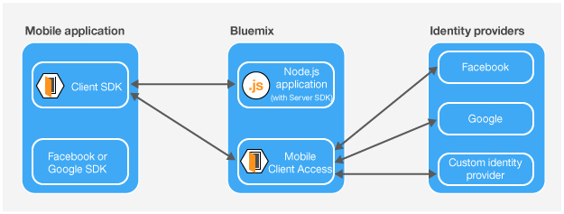
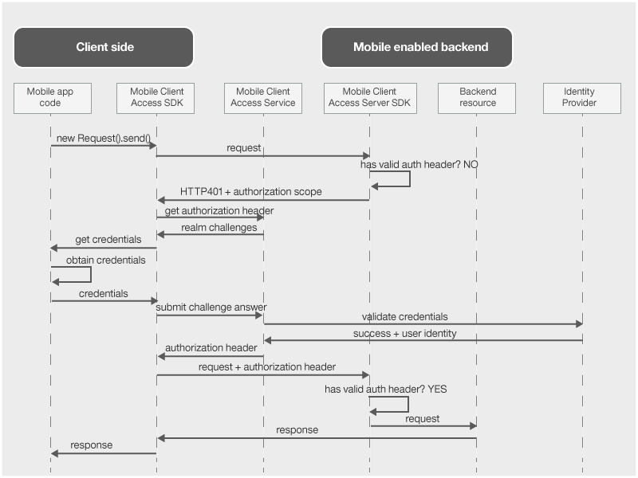

---

copyright:
  años: 2015, 2016

---

# Acerca de {{site.data.keyword.amashort}}
{: #mca-overview}

El servicio de {{site.data.keyword.amafull}} proporciona servicios de autenticación y supervisión para aplicaciones móviles que acceden a recursos alojados en {{site.data.keyword.Bluemix_notm}}.

Puede utilizar el servicio de {{site.data.keyword.amashort}} para proteger las aplicaciones de Node.js y Liberty for Java&trade; que estén alojadas en {{site.data.keyword.Bluemix_notm}} con varios tipos de autenticación. Al instrumentar las aplicaciones móviles con el SDK de {{site.data.keyword.amashort}}, puede utilizar las prestaciones de autenticación que proporciona el servicio de {{site.data.keyword.amashort}}. Los datos de supervisión y de los registros del lado de cliente se recopilan automáticamente y se envían al servicio de {{site.data.keyword.amashort}} a petición. Utilice el panel de control de {{site.data.keyword.amashort}} para configurar los diversos tipos de autenticación y ver los datos que se recopilan desde el SDK del lado de cliente.

**Nota**: el servicio de {{site.data.keyword.amashort}} anteriormente se conocía como Advanced Mobile Access.

## Componentes de {{site.data.keyword.amashort}}
{: #components}

* **Panel de control de {{site.data.keyword.amashort}}**: configure diversos tipos de autenticación y supervise los registros de dispositivo, las estadísticas de uso, las analíticas y el rendimiento de la aplicación móvil.
* **SDK del cliente de {{site.data.keyword.amashort}}**: prepare las aplicaciones móviles para que utilicen la funcionalidad {{site.data.keyword.amashort}}. Las plataformas admitidas son: iOS 8+, Android 4+, Cordova.
* **SDK del servidor de {{site.data.keyword.amashort}}**: proteja los recursos que se alojan en {{site.data.keyword.Bluemix_notm}}. Los tiempos de ejecución que se admiten actualmente son Node.js y Liberty for Java&trade;.

## Tipos de autenticación
{: #authtypes}
Puede utilizar los siguientes tipos de autenticación en la app móvil:
* **Facebook**: utilice Facebook como proveedor de identidad. Los usuarios inician sesión en la app móvil con las credenciales de Facebook.
* **Google**: utilice Google como proveedor de identidad. Los usuarios inician sesión en la app móvil con las credenciales de Google+.
* **Personalizada**: cree un proveedor de identidad. Controlará totalmente qué tipo de información se recopila y valida.

## Visión general de la arquitectura de {{site.data.keyword.amashort}}
{: #architecture}

* Proteja los recursos de nube (aplicaciones Node.js) con el SDK del servidor de {{site.data.keyword.amashort}}.
* Utilice la clase `Request` que proporciona el SDK del cliente de {{site.data.keyword.amashort}}  para la comunicación con los recursos de nube protegidos. 
* El SDK del servidor de {{site.data.keyword.amashort}} detecta una solicitud no autorizada y devuelve un error de autorización HTTP 401. 
* El SDK del cliente de {{site.data.keyword.amashort}} detecta el error de autorización HTTP 401 e inicia automáticamente el proceso de autenticación con el servicio de {{site.data.keyword.amashort}}. 
* La autenticación de Facebook, Google o Personalizada se utilizan para autenticarse.
* Después de una autenticación satisfactoria, {{site.data.keyword.amashort}} devuelve una señal de autorización.
* El SDK del cliente de {{site.data.keyword.amashort}} añade automáticamente la señal de autorización a la solicitud original y vuelve a enviar la solicitud al recurso de nube. 
* El SDK del servidor de {{site.data.keyword.amashort}} extrae la señal de acceso de la solicitud y la valida con el servicio de {{site.data.keyword.amashort}}. 
* Se otorga el acceso.  La respuesta se devuelve a la aplicación móvil.

## Flujo de solicitudes de {{site.data.keyword.amashort}}
{: #flow}
En el diagrama siguiente se describe el flujo de una solicitud, desde el SDK a los proveedores de identidad y programa de fondo móvil.

1. Utilice el SDK de {{site.data.keyword.amashort}} para realizar una solicitud a los recursos de fondo que están protegidos por el SDK del servidor de {{site.data.keyword.amashort}}. 
* El SDK del servidor de {{site.data.keyword.amashort}} detecta una solicitud no autorizada y devuelve HTTP 401 y un ámbito de autorización. 
* El SDK del cliente de {{site.data.keyword.amashort}} detecta automáticamente el código HTTP 401 e inicia el proceso de autenticación. 
* El SDK del cliente de {{site.data.keyword.amashort}} contacta con el servicio de {{site.data.keyword.amashort}} y solicita que emita una cabecera de autorización. 
* El servicio de {{site.data.keyword.amashort}} solicita a la app del cliente que realice la autenticación primero proporcionando el cambio de autenticación según el tipo de autenticación configurado actualmente.
* En el SDK del cliente de {{site.data.keyword.amashort}}: 
   *  **Autenticación de Facebook o Google:** procesa automáticamente el cambio de autenticación (para la autenticación de Facebook o Google)
   * **Autenticación Personalizada**: obtiene las credenciales según la lógica que proporcione el desarrollador.
* Si se configura la autenticación de Facebook o Google, el SDK del cliente de {{site.data.keyword.amashort}} utiliza el SDK asociado para obtener las señales de acceso de Facebook o Google. Estas señales sirven de respuesta al cambio de autenticación.
* Si se configura la autenticación Personalizada, el desarrollador debe obtener la respuesta al cambio de autenticación y suministrarla al SDK del cliente de {{site.data.keyword.amashort}}. 
* Después de obtenerse la respuesta al cambio de autenticación, se envía al servicio de {{site.data.keyword.amashort}}.
* El servicio valida la respuesta al cambio de autenticación con el proveedor de identidad correspondiente (Facebook/Google/Personalizada).
* Si la validación es satisfactoria, el servicio de {{site.data.keyword.amashort}} genera una cabecera de autorización y la devuelve al SDK del cliente de {{site.data.keyword.amashort}}. La cabecera de autorización contiene dos señales: una señal de acceso con información sobre permisos de acceso y una señal de ID que incluye información sobre la aplicación, el dispositivo y el usuario actuales.
* A partir de este momento, todas las solicitudes realizadas con el SDK del cliente de {{site.data.keyword.amashort}} tendrán una cabecera de autorización nueva. 
* El SDK del cliente de {{site.data.keyword.amashort}} vuelve a enviar automáticamente la solicitud original que activó el flujo de autorización. 
* El SDK del servidor de {{site.data.keyword.amashort}} extrae la cabecera de autorización de la solicitud, valida la cabecera con el servicio de {{site.data.keyword.amashort}} y otorga acceso a un recurso de fondo. 
