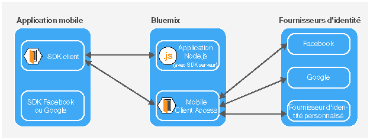
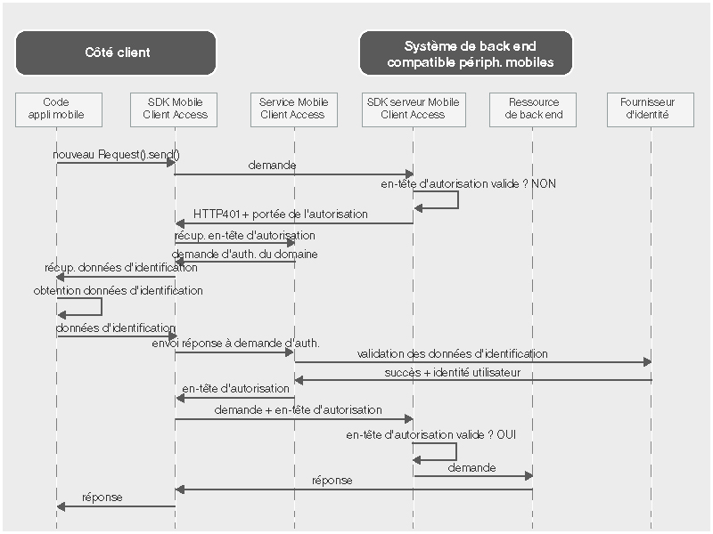

---

Copyright : 2015, 2016

---

# À propos de {{site.data.keyword.amashort}}
{: #mca-overview}

Le service {{site.data.keyword.amafull}} fournit des services d'authentification et de surveillance pour les applications mobiles qui accèdent à des ressources de cloud hébergées dans {{site.data.keyword.Bluemix_notm}}.

Vous pouvez utiliser le service {{site.data.keyword.amashort}} pour protéger les applications Node.js et Liberty for Java&trade; hébergées sur {{site.data.keyword.Bluemix_notm}} avec différents types d'authentification. L'instrumentation de vos applications mobiles avec le SDK de {{site.data.keyword.amashort}} vous permet d'utiliser les capacités d'authentification du service {{site.data.keyword.amashort}}. Les journaux de surveillance et côté client sont collectés automatiquement et envoyés au service {{site.data.keyword.amashort}} à la demande. Utilisez le tableau de bord {{site.data.keyword.amashort}} pour configurer les différents types d'authentification et voir les données collectées par le SDK côté client.

**Remarque** : L'ancien nom du service {{site.data.keyword.amashort}} est Advanced Mobile Access.

## Composants {{site.data.keyword.amashort}}
{: #components}

* **Tableau de bord {{site.data.keyword.amashort}}** : Configurer différents types d'authentification et surveiller les performances, les fonctions d'analyse, les statistiques d'utilisation et les journaux d'unité des applications mobiles.
* **SDK client de {{site.data.keyword.amashort}}** : Instrumenter les applications mobiles pour leur permettre d'utiliser les fonctionnalités {{site.data.keyword.amashort}}. Les plateformes prises en charge sont : iOS 8+, Android 4+, Cordova.
* **SDK serveur de {{site.data.keyword.amashort}}** : Protéger les ressources hébergées sur {{site.data.keyword.Bluemix_notm}}. Les contextes d'exécution pris en charge actuellement sont Node.js et Liberty for Java&trade;.

## Types d'authentification
{: #authtypes}
Vous pouvez utiliser les types d'authentification suivants dans votre appli mobile :
* **Facebook** : Utilisez Facebook en tant que fournisseur d'identité. Vos utilisateurs se connectent à l'appli mobile avec leurs données d'identification Facebook.
* **Google** : Utilisez Google en tant que fournisseur d'identité. Vos utilisateurs se connectent à l'appli mobile avec leurs données d'identification Google+.
* **Personnalisée**: Créez votre propre fournisseur d'identité. Vous contrôlez entièrement les types d'informations collectées et validées.

## Présentation de l'architecture {{site.data.keyword.amashort}}
{: #architecture}

* Protégez vos ressources de cloud (applications Node.js) avec le SDK serveur de {{site.data.keyword.amashort}}.
* Utilisez la classe `Request` fournie par le SDK client de {{site.data.keyword.amashort}} pour communiquer avec vos ressources de cloud protégées.
* Le SDK serveur de {{site.data.keyword.amashort}} détecte une demande non autorisée et renvoie une demande d'autorisation HTTP 401.
* Le SDK client de {{site.data.keyword.amashort}} détecte la demande d'autorisation HTTP 401 et lance automatiquement le processus d'authentification avec le service  {{site.data.keyword.amashort}}.
* L'authentification est réalisée à l'aide de Facebook, de Google ou de l'authentification personnalisée.
* Après une authentification réussie, {{site.data.keyword.amashort}} renvoie un jeton d'autorisation.
* Le SDK client de {{site.data.keyword.amashort}} ajoute automatiquement le jeton d'autorisation à la demande d'origine et renvoie la demande à la ressource de cloud.
* Le SDK serveur de {{site.data.keyword.amashort}} extrait le jeton d'accès de la demande et le valide auprès du service {{site.data.keyword.amashort}}.
* L'accès est accordé.  La réponse est renvoyée à l'application mobile.

## Flux des demandes {{site.data.keyword.amashort}}
{: #flow}
Le diagramme suivant montre le trajet d'une demande du logiciel SDK au système de back end mobile et aux fournisseurs d'identité.

1. Utilisez le SDK {{site.data.keyword.amashort}} pour envoyer une demande à vos ressources de back end qui sont protégées par le SDK serveur de {{site.data.keyword.amashort}}.
* Le SDK serveur de {{site.data.keyword.amashort}} détecte une demande non autorisée et renvoie une erreur HTTP 401 et la portée d'autorisation.
* Le SDK client de {{site.data.keyword.amashort}} détecte automatiquement l'erreur HTTP 401 et lance le processus d'authentification.
* Le SDK client de {{site.data.keyword.amashort}} contacte le service {{site.data.keyword.amashort}} et lui demande d'émettre un en-tête d'autorisation.
* Le service {{site.data.keyword.amashort}} demande à l'app client de s'authentifier en fournissant une demande d'authentification conforme au type d'authentification configuré.
* Le SDK client de {{site.data.keyword.amashort}} se trouve devant l'alternative suivante :
   *  **Authentification Facebook ou Google :** Il traite automatiquement la demande d'authentification (pour l'authentification Facebook ou Google)
   * **Authentification personnalisée** : Obtient les données d'identification selon la logique fournie par le développeur.
* Si l'authentification Facebook ou Google est configurée, le SDK client de {{site.data.keyword.amashort}} utilise le SDK associé pour obtenir les jetons d'accès Facebook ou Google. Ces jetons servent de réponse à la demande d'authentification.
* Si l'authentification personnalisée est configurée, le développeur doit obtenir la réponse à la demande d'authentification et la fournir au SDK client de {{site.data.keyword.amashort}}.
* La réponse à la demande d'authentification obtenue est envoyée au service {{site.data.keyword.amashort}}.
* Le service valide la réponse à la demande d'authentification auprès du fournisseur d'identité concerné (Facebook/Google/authentification personnalisée).
* Si la validation aboutit, le service {{site.data.keyword.amashort}} génère un en-tête d'autorisation et le renvoie au SDK client de {{site.data.keyword.amashort}}. L'en-tête d'autorisation contient deux jetons : un jeton qui contient des informations sur les droits d'accès, et un autre jeton qui contient des informations sur l'utilisateur, le périphérique et l'application.
* A partir de ce moment, toutes les demandes faites avec le SDK client de {{site.data.keyword.amashort}} contiennent un nouvel en-tête d'autorisation.
* Le SDK client de {{site.data.keyword.amashort}} renvoie automatiquement la demande d'origine qui avait déclenché le flux d'autorisation.
* Le SDK serveur de {{site.data.keyword.amashort}} extrait l'en-tête d'autorisation de la demande, la valide auprès du service {{site.data.keyword.amashort}} et donne l'accès à la ressource de back end.
