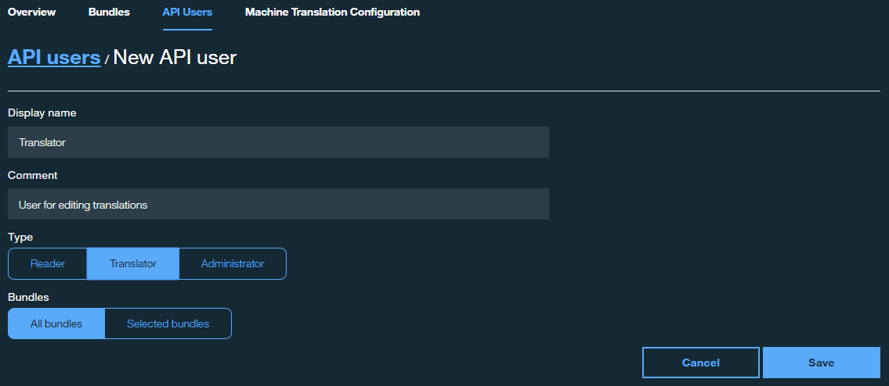

---

copyright:
  years: 2015, 2016

---

{:new_window: target="_blank"}
{:shortdesc: .shortdesc}
{:screen:.screen}
{:codeblock:.codeblock}

# 翻訳の管理
{: #globalizationpipeline_managingtranslations}

*最終更新日: 2016 年 7 月 6 日*
{: .last-updated}

バンドルを作成してアプリケーションの翻訳の生成を開始したら、機械生成されたコンテンツをそのまま使用したり、さらに修正して使用したりできます。また、デフォルト以外の機械翻訳を使用することもできます。このセクションでは、バンドルの翻訳を実行する機械翻訳エンジンを変更する方法、手作業で翻訳後の編集を行う方法、ユーザー役割を割り当てて、翻訳へのアクセスが必要な人にアクセスを制限する方法について説明します。
{:shortdesc}

## 機械翻訳の構成
{: #globalizationpipeline_service_to_service}

{{site.data.keyword.GlobalizationPipeline_full}}は、バンドルの機械翻訳を実行するために別の機械翻訳サービスと統合する機能をサポートしています。別のサービスを追加する機能は、{{site.data.keyword.GlobalizationPipeline_full}}で使用されるデフォルトのエンジンでは必要な特定の言語がサポートされていない場合や、別のエンジンで生成される機械翻訳のほうが好ましい場合に便利です。別のサービスの使用や料金については、そのサービスの利用規約の対象になります。

{{site.data.keyword.GlobalizationPipeline_full}}に別の機械翻訳サービスを追加して構成するには、{{site.data.keyword.GlobalizationPipeline_full}}・ダッシュボードの**「機械翻訳の構成 (Machine Translation Configuration)」**タブを選択します。

* {{site.data.keyword.Bluemix_notm}} カタログに含まれている機械翻訳サービス (**Watson 言語翻訳**) を追加するために、先にそのサービスを {{site.data.keyword.Bluemix_notm}} スペースに追加しておく必要があります。

* サード・パーティーのサービスを追加するには、**「機械翻訳の構成 (Machine Translation Configuration)」**タブでそのサービスのボタンを選択し、そのサービスへのアクセスに必要なユーザー資格情報を入力します。

機械翻訳サービスが{{site.data.keyword.GlobalizationPipeline_full}}に追加されたら、残りの手順を実行してサービスの統合を完了させます。

1. **「有効にする (Enable)」**をクリックして、そのサービスとの統合をオンにします。

2. 「**言語を更新する (Update Languages)**」をクリックして、サポートされるターゲット言語の更新されたリストを表示します。

3. ターゲット言語のリストから、翻訳を実行する機械翻訳エンジンを選択します。

4. **「保存」**をクリックして、**「機械翻訳の構成 (Machine Translation Configuration)」**タブに戻ります。

{{site.data.keyword.GlobalizationPipeline_full}}に別のサービスが構成されると、そのエンジンに割り当てられているすべてのターゲット言語の生成が、そのエンジンを使用して開始されます。 

別の機械翻訳エンジンの使用を停止するには、次のようにします。

1. **「機械翻訳の構成 (Machine Translation Configuration)」**タブで、使用を停止するサービスの**「無効にする (Disable)」**ボタンをクリックします。

別の機械翻訳サービスを無効にしても、そのサービスによって生成された翻訳はすべてバンドル内に残されます。しかし、現在有効にしている機械翻訳エンジンで特定のターゲット言語がサポートされなくなった場合は、そのターゲット言語への翻訳を今後更新できなくなる可能性があります。

<!-- Review comment: When you disable an engine, do you need to go back and reconfigure the languages?? Does it go back to the default engine? What happens? -->

## 翻訳の表示と編集
{: #globalizationpipeline_translations}

{{site.data.keyword.GlobalizationPipeline_full}}のサービスでは、手作業で翻訳後の編集を行うことができます。生成された翻訳に、ターゲット言語のプロの翻訳者や知識を持つ人が編集を加えることができます。編集して、翻訳の品質や一貫性を向上させたり、望ましい別の言い回しに変更したりできます。例えば、製品名の訳を上書きしたりする必要があるでしょう。

ターゲット言語の翻訳を表示して編集するには、次のようにします。

1. **「バンドルの詳細 (Bundle details)」**ページで、ターゲット言語を選択するか、または「アクション」列の**「翻訳の表示 (View the translations)」**アイコン  をクリックします。
2. キー、ソース、翻訳情報という表形式で、翻訳が表示されます。
 * **キー:** リソース・ファイルに含まれている属性 (関連付けられた値があります) を表します。
 * **ソース:** アップロードされたリソース・ファイルに含まれていた翻訳可能ストリングを表します。
 * **翻訳:** ソースの値を翻訳したバージョンを表します。
3. 「アクション」列で、**「翻訳の変更 (Modify the translation)」**アイコン  をクリックし、機械翻訳による値を編集します。
4. 翻訳を編集し、**「更新」**をクリックして、元の翻訳値を、編集した値に更新します。

 

***ヒント:*** 数多くの翻訳可能キーが含まれている大規模なバンドルを操作する場合は、特定の値を見つけることが大変な場合があります。ターゲット言語翻訳ページの**「検索 ...(Search for...)」** ボックスを使用すると、すべてのキー、ソース、翻訳の中から素早く検索できます。

 

## API ユーザーの追加
{: #globalizationpipeline_users}

翻訳を管理していると、追加の API ユーザーに対して、そのユーザーが実行する必要のあるタスクに基づいてアクセスを許可したい場合があります。例えば、翻訳者には、翻訳の編集を許可する一方でバンドル情報は変更できないようにする必要があるでしょう。

| 役割タイプ | 翻訳の表示? | 翻訳の編集? | バンドル情報の変更? |
|-----------|--------------------|--------------------|----------------------------|
| 読者 | Yes | No | No |
| 翻訳者 | Yes | Yes | No |
| 管理者 | Yes | Yes | Yes |

ほかにも API ユーザーを作成する場合は、1 つ以上の特定のバンドルにアクセスを制限するか、使用可能なすべてのバンドルへのアクセスを許可することができます。

{{site.data.keyword.GlobalizationPipeline_full}}のサービス・インスタンス内のバンドルへのアクセスを API ユーザーに許可するには、次のようにします。

1. {{site.data.keyword.GlobalizationPipeline_full}}のダッシュボードで、**「API ユーザー (API Users)」**タブをクリックします。
2. **「新しい API ユーザー (New API User)」**をクリックします。
3. **「表示名 (display name)」**と**「コメント (comment)」**に、新しい API ユーザーについての内容を入力します。
4. 新しい API ユーザーの**「タイプ」**を選択します。
5. API ユーザーに、すべてのバンドルへのアクセスを許可するのか、選択したバンドルへのアクセスのみを許可するのかを選択します。
6. **「保存」**をクリックします。

API のユーザー ID とパスワードが生成され、表示されます。それらの資格情報をコピーして保存します。ウィンドウを閉じた後にそれらを再び取得することはできません。資格情報は、[SDK](https://github.com/IBM-Bluemix/gp-common) を使用して RESTful サービスで使用できます。 

API ユーザー・パスワードを再設定するには、次のようにします。

1. {{site.data.keyword.GlobalizationPipeline_full}}のダッシュボードで、**「API ユーザー (API Users)」**タブをクリックします。
2. **「パスワードの再設定 (Reset Password)」**アイコン  をクリックし、特定のユーザー ID のパスワードを再設定します。 
3. **「はい」**をクリックします。 
