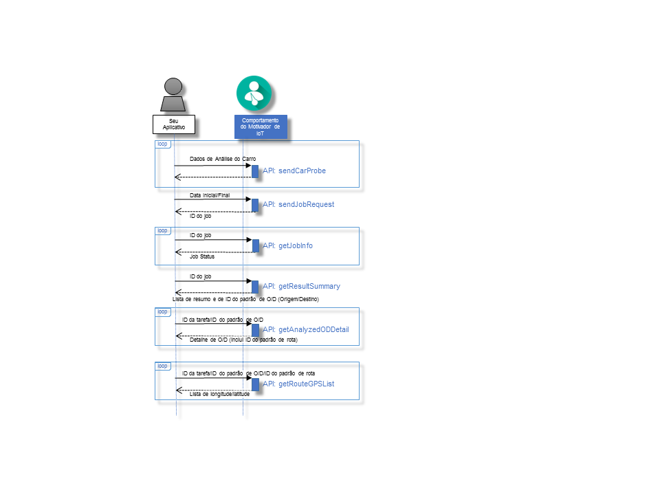

---

copyright:
  years: 2016

---

{:new_window: target="_blank"}
{:shortdesc: .shortdesc}
{:screen: .screen}
{:codeblock: .codeblock}
{:pre: .pre}

# Introdução ao Trajectory Pattern Analysis
{: #tp_index}
Última atualização: 16 de junho de 2016
{: .last-updated}

O Trajectory Pattern Analysis API é um serviço dentro do serviço {{site.data.keyword.iotdriverinsights_full}} do {{site.data.keyword.Bluemix_notm}} que pode ser usado para analisar os padrões de Origem/Destino (O/D) e de rota de viagens de carro nos dados de análise do carro.

{:shortdesc}

O diagrama a seguir descreve uma sequência típica de chamadas API no Trajectory Pattern Analysis:

Depois de criar e implementar o {{site.data.keyword.iotdriverinsights_short}} como uma instância de serviço desvinculada, conclua as tarefas a seguir para integrar seus aplicativos ao Trajectory Pattern Analysis API.

## Antes
de Começar
{: #tp_byb}
- Revise o tópico [Sobre o Trajectory Pattern Analysis](tp_iotdriverinsights_overview.html) para familiarizar-se com os comportamentos e contextos analisáveis.
- Obtenha os valores *Tenant ID*, *Username* e *Password* gerados automaticamente, necessários para acessar a API do {{site.data.keyword.iotdriverinsights_short}}:

  1. No painel do {{site.data.keyword.Bluemix_notm}}, clique no quadro do serviço {{site.data.keyword.iotdriverinsights_short}}.
  2. Selecione a visualização **Gerenciar** de sua instância de serviço.

  3. Anote os valores de tenant ID, user name e password.

## Tarefa 1: fazendo upload de dados do veículo
{: #tp_task1}
Faça upload de múltiplos conjuntos de dados de viagens de carro para o locatário do {{site.data.keyword.iotdriverinsights_short}} para disponibilizar os dados do motorista para o Trajectory Pattern Analysis.

1. Envie dados de análise do carro para o armazenamento para serem analisados com a API `sendCarProbeData`.
Faça upload de dados de análise do carro para o {{site.data.keyword.iotdriverinsights_short}}.
   - Solicitação: dados de análise do carro

## Tarefa 2: processando dados do veículo
{: #tp_task2}

Processe os dados do veículo para analisar o padrão de O/D (Origem/Destino) e o padrão de rota

1. Envie uma solicitação de tarefa para analisar dados de análise do carro em um determinado período com o `sendJobRequest` do Trajectory Pattern Analysis API.
   - Solicitação: data inicial e final
   - Resposta: ID da tarefa
2. Verifique o status da tarefa com o `getJobInfo` do Trajectory Pattern Analysis API.
O processamento de dados estará completo quando o status da tarefa retornar o estado 'BEM-SUCEDIDO'. Agora será possível solicitar os dados de resultado da análise de padrão da trajetória.
   - Solicitação: ID da tarefa
   - Resposta: status da tarefa

## Tarefa 3: analisar viagens
{: #tp_task3}
Analise viagens a partir de um intervalo de data específico para entender sua conformidade com os parâmetros de limite de análise.

1. Para obter a lista de resumo de padrões analisados (Origem/Destino), use o `getResultSummary` do Trajectory Pattern Analysis API.
A lista de resumo de padrão de O/D inclui informações de resumo de viagem analisadas de acordo com os parâmetros de entrada:
   - Solicitação: ID da tarefa
   - Resposta: lista de resumo e de ID do padrão de O/D (Origem/Destino)
2. Para obter as informações de padrão de O/D e de padrão de rota analisadas detalhadas, use o `getAnalyzedDetail` do comando do Trajectory Pattern Analysis API.
Obtenha as informações de padrão de trajetória detalhadas para viagens analisadas.
   - Solicitação: ID da tarefa/ID do padrão de O/D
   - Resposta: detalhes de O/D (inclui ID do padrão de rota)
3. Para recuperar uma lista de pontos de GPS de cada padrão de rota, use o `getRouteGPSList` do Trajectory Pattern Analysis API.
Finalmente, obtenha a lista de pontos de GPS de um padrão de rota específico.
   - Solicitação: ID da tarefa/ID do padrão de O/D/ID do padrão de rota
   - Resposta: lista de Longitude/Latitude de um padrão de rota

## Etapas seguintes
{: #tp_post}
Ao concluir as etapas, um conjunto de dados do padrão de trajetória analisado será gerado em sua organização. Use seus aplicativos ou seu software de análise de dados
preferencial para
processar as informações ainda mais em dados de negócios mais significativos.

# Links Relacionados
{: #rellinks}

## Referência da API
{: #api}

* [Docs API](http://ibm.biz/IoTDriverBehavior_APIdoc){:new_window}

## Outros recursos
{: #general}

* [Introdução
ao {{site.data.keyword.iotmapinsights_short}}](../IotMapInsights/index.html){:new_window}
* [Introdução
ao {{site.data.keyword.iot_full}}](https://www.ng.bluemix.net/docs/services/IoT/index.html){:new_window}
* [dW Answers no IBM developerWorks](https://developer.ibm.com/answers/topics/iot-driver-behavior){:new_window}
* [Estouro da capacidade](http://stackoverflow.com/questions/tagged/iot-driver-behavior){:new_window}
* [O que há de novo em Serviços do Bluemix](http://www.ng.bluemix.net/docs/whatsnew/index.html#services_category){:new_window}
