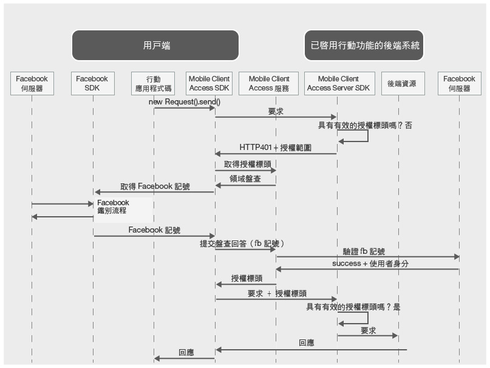

---

copyright:
  years: 2015, 2016

---
{:new_window: target="_blank"}
{:shortdesc: .shortdesc}
{:screen: .screen}
{:codeblock: .codeblock}

# 使用 Facebook 認證鑑別使用者
{: #facebook-auth-overview}

前次更新：2016 年 7 月 22 日
{: .last-updated}

您可以配置 {{site.data.keyword.amashort}} 服務，以使用 Facebook 作為身分提供者來保護資源。您的行動或 Web 應用程式使用者都可以使用其 Facebook 認證進行鑑別。
{:shortdesc}

**重要事項**：您不需要個別安裝 Facebook 所提供的 Client SDK。當您配置 {{site.data.keyword.amashort}} Facebook Client SDK 時，相依關係管理程式會自動安裝 Facebook SDK。

## {{site.data.keyword.amashort}} 要求流程
{: #mca-facebook-sequence}

### 行動用戶端要求流程

請參閱下圖，以瞭解 {{site.data.keyword.amashort}} 如何從行動用戶端應用程式中與 Facebook 整合來進行鑑別。

* 使用 {{site.data.keyword.amashort}} 用戶端 SDK，對使用 {{site.data.keyword.amashort}} 伺服器 SDK 保護的後端資源提出要求。
* {{site.data.keyword.amashort}} 伺服器 SDK 偵測到未獲授權的要求，並傳回 HTTP 401 代碼及授權範圍。
* {{site.data.keyword.amashort}} 用戶端 SDK 自動偵測到 HTTP 401 代碼，並啟動鑑別處理程序。
* {{site.data.keyword.amashort}} 用戶端 SDK 聯絡 {{site.data.keyword.amashort}} 服務，並要求授權標頭。
* {{site.data.keyword.amashort}} 服務提供鑑別盤查，以要求先向 Facebook 鑑別用戶端。
* {{site.data.keyword.amashort}} 用戶端 SDK 使用 Facebook SDK 來啟動鑑別處理程序。成功鑑別之後，Facebook SDK 傳回 Facebook 存取記號。
* Facebook 存取記號視為鑑別盤查回答。記號會傳送給 {{site.data.keyword.amashort}} 服務。
* 服務向 Facebook 伺服器驗證鑑別盤查回答。
* 如果驗證成功，則 {{site.data.keyword.amashort}} 服務會產生授權標頭，並將它傳回給 {{site.data.keyword.amashort}} 用戶端 SDK。授權標頭包含兩個記號：包含存取權資訊的存取記號，以及包含現行使用者、裝置及應用程式相關資訊的 ID 記號。
* 從此時起，透過 {{site.data.keyword.amashort}} 用戶端 SDK 所提出的所有要求都會有新取得的授權標頭。
* {{site.data.keyword.amashort}} 用戶端 SDK 自動重新傳送已觸發授權流程的原始要求。
* {{site.data.keyword.amashort}} 伺服器 SDK 從要求擷取授權標頭、向 {{site.data.keyword.amashort}} 服務驗證授權標頭，然後授與對後端資源的存取權。

### {{site.data.keyword.amashort}} Web 應用程式要求流程
{: #mca-facebook-web-sequence}

{{site.data.keyword.amashort}} Web 應用程式要求流程類似於行動用戶端流程。不過，{{site.data.keyword.amashort}} 會保護 Web 應用程式，而不是 {{site.data.keyword.Bluemix_notm}} 後端資源。

  * 起始要求是由 Web 應用程式傳送（例如，從登入表單中）。
  * 最終重新導向是重新導向至 Web 應用程式本身的受保護區域，而不是後端的受保護資源。 

## 從 Facebook 開發人員入口網站取得 Facebook 應用程式 ID
{: #facebook-appID}

若要開始使用 Facebook 作為身分提供者，您必須在「Facebook 開發人員入口網站」中建立應用程式。在此處理程序期間，您會取得「Facebook 應用程式 ID」（這是唯一 ID，可讓 Facebook 知道哪一個應用程式正在嘗試連接）。

1. 開啟 [Facebook 開發人員入口網站](https://developers.facebook.com)。

1. 按一下功能表中的**我的應用程式**，然後選取**建立新的應用程式**。
選取 iOS 或 Android 應用程式，然後在下一個畫面上按一下**跳過並建立應用程式 ID**。

1. 設定您選擇的應用程式顯示名稱，並挑選種類。按一下**建立應用程式 ID** 以繼續。

1. 複製顯示的**應用程式 ID**。此值是您的「Facebook 應用程式 ID」。您需要這個值來配置行動或 Web 應用程式的 Facebook 鑑別。

## 後續步驟
{: #next-steps}

* [啟用 Android 應用程式的 Facebook 鑑別](facebook-auth-android.html)
* [啟用 iOS 應用程式的 Facebook 鑑別 (Swift SDK)](facebook-auth-ios-swift-sdk.html)
* [啟用 iOS 應用程式的 Facebook 鑑別（Objective-C SDK - 已淘汰）](facebook-auth-ios.html)
* [啟用 Cordova 應用程式的 Facebook 鑑別](facebook-auth-cordova.html)
