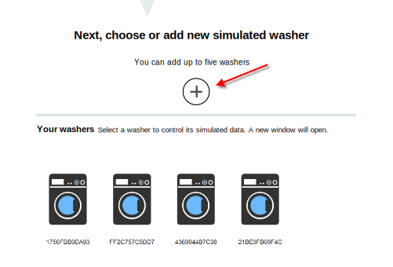
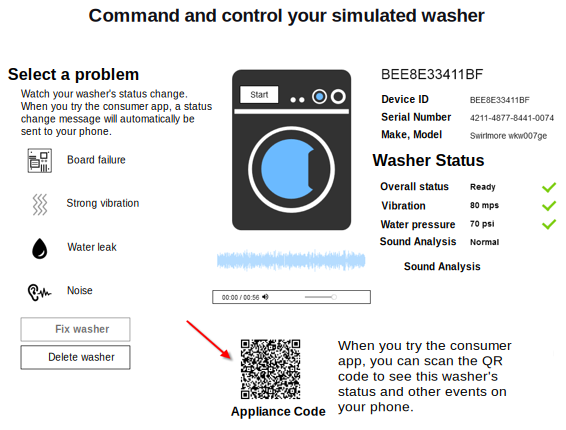

---

copyright:
  years: 2016, 2017
lastupdated: "2017-02-24"

---

<!-- Common attributes used in the template are defined as follows: -->
{:new_window: target="\_blank"}
{:shortdesc: .shortdesc}
{:screen:.screen}
{:codeblock:.codeblock}

# Using the mobile app
{: #iot4e_using_mobile}

Get started with the {{site.data.keyword.iotelectronics_full}} mobile app to see how you can receive alerts, send commands, and check the status of your connected appliances by using your mobile device, such as a smartphone or tablet.
{:shortdesc}

Before you can use the mobile app, you must complete the following tasks:
  - Deploy an instance of the {{site.data.keyword.iotelectronics}} starter in your {{site.data.keyword.Bluemix_notm}} organization. Deploying an instance of the starter automatically deploys the component applications and services of the starter.
  - [Enable mobile communications and security](iotelectronics_config_mca.html) by configuring {{site.data.keyword.amafull}}.

To get started with the mobile app, complete the following tasks:
1. [Download the mobile app](#iot4e_downloadmobile) to your mobile device.
2. [Connect the mobile app to the {{site.data.keyword.iotelectronics}} environment](#iot4e_connecting_mobile) and register your appliances.

## Downloading the mobile app
{: #iot4e_downloadmobile}
You can get the mobile app for iOS or Android mobile devices.
- **iOS devices** - Download the app from the Apple App store.  On your mobile device, open the App store and search for "ibm iot". Choose **IBM IoT for Electronics** and install.  Alternatively, you can install it to your mobile device by using [iTunes](https://itunes.apple.com/us/app/ibm-iot-for-electronics/id1103404928?ls=1&mt=8).
- **Android devices** - Download the app from the Google Play store. On your mobile device, open the App store and search for "ibm iot". Choose **IBM IoT for Electronics** and install.

## Connecting the mobile app
{: #iot4e_connecting_mobile}

To connect the mobile app to your environment and register your appliances, perform the following tasks:

1. Open your {{site.data.keyword.iotelectronics}} starter app. For instructions, see [Opening the starter app](iot4ecreatingappliances.html#iot4e_openAppMain).

2. Select **Remotely control your connected appliances**.

    

3. Create one or more washers by scrolling to the section that is labeled **Next, choose or add new simulated washer** and then by clicking the + icon. A new washer is created.

    

4.	Scroll to the Connection QR code and scan it using your mobile device. The Connection QR code is located in the section labeled **To connect the app to the environment, you'll be asked to scan this QR Code**.

  

5. On your mobile device, enter login credentials. Your user ID and password can be any length. Remember your login credentials for future sessions. Your mobile device is now registered to your {{site.data.keyword.iotelectronics}} environment, and you are ready to register individual appliances.

6. On your computer, scroll to a simulated washer and click it to display its data and Appliance QR code.

  

7.	Use your mobile device to scan the QR code of the washer. The washer is now registered, and the washer status appears on your mobile device.

**What's next**
You can now view alerts and control the washer by using your mobile device. Try it by doing the following steps:
  - On your computer, select a problem with the washer, such as Board Failure or Strong Vibration. The problem sends an alert to your mobile device.
  - On your mobile device, click **Start wash** to start the machine. You can see the washer status change on your computer as it goes through each wash cycle.
