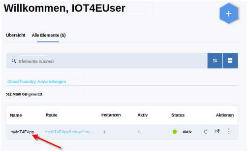
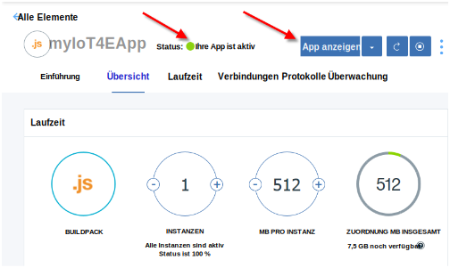
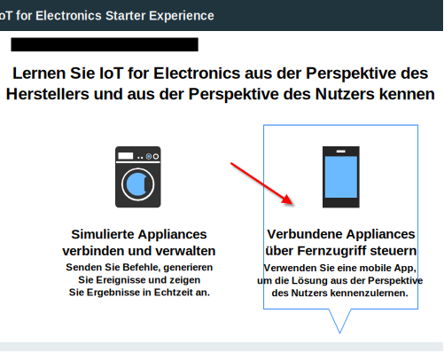

---

copyright:
  years: 2016
lastupdated: "2016-11-29"

---

{:new_window: target="\_blank"}

{:shortdesc: .shortdesc}

# Starter-App verwenden
Erstellen Sie simulierte Appliances in der {{site.data.keyword.iotelectronics_full}}-Starter-App und bekommen Sie einen Eindruck davon, wie ein EM (Enterprise Manufacturer) Appliances überwachen kann, die mit der {{site.data.keyword.iot_short_notm}} verbunden sind. Sie können manuell mit der simulierten Appliance interagieren, um Alerts, Benachrichtigungen und Aktionen auszulösen.
{:shortdesc}

## Starter-App öffnen
{: #iot4e_openApp}

1. Starten Sie in Ihrem {{site.data.keyword.Bluemix_notm}}-Dashboard Ihre {{site.data.keyword.iotelectronics}}-Starteranwendung, indem Sie auf die Kachel für die Starteranwendung klicken.

    

2. Warten Sie, bis die Statusnachricht *Ihre App ist aktiv* im Header angezeigt wird, und klicken Sie anschließend auf **App anzeigen**, um die Starter-App anzuzeigen.  

    

## Simulierte Appliances erstellen
{: #create_sim}

In der Starter-App können Sie simulierte Appliances wie der Appliancehersteller oder ein Konsument erstellen und steuern. Status- und Ereignisdaten für diese simulierten Appliances werden gespeichert und können in {{site.data.keyword.iot_full}} angezeigt werden.

1. Wählen Sie eine der folgenden Optionen aus:
    - **Verbinden und verwalten simulierter Appliances** zur Erstellung simulierter Appliances wie der Appliancehersteller
    - **Steuern der eigenen verbundenen Appliances per Fernzugriff** zur Erstellung simulierter Appliances sowie zur Herstellung einer Verbindung mit dem [Beispiel einer mobilen App](iotelectronics_config_mobile.html) wie der Applianceeigner.

    

2. Blättern Sie bis zu dem Abschnitt mit dem Titel **Wählen Sie nun eine simulierte Waschmaschine aus oder erstellen Sie eine neue Waschmaschine** und klicken Sie auf das Plussymbol. Es wird eine neue Waschmaschine erstellt.

    

3. Um Details zu Ihrer Waschmaschine anzuzeigen, Befehle abzusetzen und Fehler zu verursachen, klicken Sie auf eine Waschmaschine.

  

# Zugehörige Links
{: #rellinks}

## API-Dokumentation
{: #api}
* [{{site.data.keyword.iotelectronics}}-API](http://ibmiotforelectronics.mybluemix.net/public/iot4eregistrationapi.html)
* [{{site.data.keyword.iot_short}}-API](https://developer.ibm.com/iotfoundation/recipes/api-documentation/)

## Komponenten
{: #general}

* [{{site.data.keyword.iotelectronics}}-Dokumentation](iotelectronics_overview.html)
* [{{site.data.keyword.iot_full}}-Dokumentation](https://console.ng.bluemix.net/docs/services/IoT/index.html)
*  [{{site.data.keyword.amashort}}-Dokumentation](https://console.ng.bluemix.net/docs/services/mobileaccess/overview.html)
* [{{site.data.keyword.sdk4nodefull}}-Dokumentation](https://console.ng.bluemix.net/docs/runtimes/nodejs/index.html#nodejs_runtime)

## Beispiele
{: #samples}
* [Beispiel für mobile App](https://console.ng.bluemix.net/docs/starters/IotElectronics/iotelectronics_config_mobile.html)
