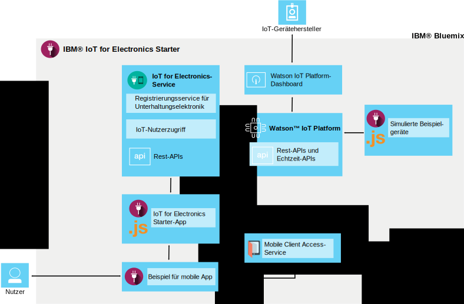

---

copyright:
  years: 2016

---

{:new_window: target="\_blank"}
{:shortdesc: .shortdesc}

# Informationen zu {{site.data.keyword.iotelectronics}}
{: #iotelectronics_about}
*Letzte Aktualisierung: 19. September 2016*
{: .last-updated}

{{site.data.keyword.iotelectronics_full}} ist eine voll integrierte IoT-Produktionsinstanz, die Apps das Kommunizieren und das Verarbeiten von Daten ermöglicht, die von den verbundenen Appliances, Sensoren und Gateways erfasst werden.
{:shortdesc}

{{site.data.keyword.iotelectronics}} verwendet den {{site.data.keyword.iot_full}}-Service, um eine Verbindung zu intelligenten elektronischen Appliances mit den von Ihnen entwickelten Anwendungen herzustellen. Da auch {{site.data.keyword.iot_short_notm}} verwendet wird, können Sie die Daten von den Appliances leichter analysieren und sich mit ihnen vertraut machen. Sie können Regeln erstellen, um Bedingungen anzugeben, die berücksichtigt werden müssen, und automatisierte Antworten definieren, zum Beispiel das Senden einer E-Mail, das Ausführen eines Node-RED-Workflows oder das Herstellen einer Verbindung zu Web-Services.  

## Starter suchen
{: #iot4eFindingStarter}
Den Starter für {{site.data.keyword.iotelectronics}} können Sie im Abschnitt [Boilerplates](https://console.{DomainName}/catalog/starters/iot-for-electronics-starter/) des {{site.data.keyword.Bluemix_notm}}-Katalogs suchen.  

## Möglichkeiten für die Arbeit mit {{site.data.keyword.iotelectronics}}
{: #Features_iote}
Die Funktionen der Lösung {{site.data.keyword.iotelectronics}} können Sie schnell durch das Simulieren von Appliances und Daten kennenlernen.

### Verbindung zu simulierten Appliances herstellen
Erstellen Sie simulierte Appliances und stellen Sie eine Verbindung von der Plattform zu ihnen her, um das Streaming von Livedaten anzuzeigen. Verwenden Sie eine webbasierte App, um zu simulieren, wie eine Appliance Befehle empfängt und Operationen ausführt. Imitieren Sie Ausfälle, um Benachrichtigungen und Alerts zu generieren. Zu Demonstrationszwecken werden Waschmaschinen als simulierte Appliance im {{site.data.keyword.iotelectronics}}-Starter verwendet. Die ausgewählte Appliance, die Sie verbinden möchten, kann ein beliebiges Elektronikgerät sein.  

### Mobile Beispielapp für Kunden testen
Verwenden Sie ein iOS-Telefon, um festzustellen, wie der Eigner einer Appliance mit der Appliance interagieren kann. Senden Sie Befehle an die Appliance und empfangen Sie Aktualisierungen von der Appliance über die Plattform und {{site.data.keyword.Bluemix_notm}}. Imitieren Sie Fehlerereignisse und zeigen Sie die Ergebnisse in der mobilen App an.

### Eigene Elektronikgeräte verbinden
Verbinden Sie Ihre eigenen Geräte sicher mit der Cloud und starten Sie mit dem Anpassen der eigenen Apps. Es steht eine Reihe geprüfter Beispiele und Anleitungen zur Verfügung, die Sie ändern und für Machbarkeitsnachweise, Tests und Versuchsreihen verwenden können.

## Informationen zum Starter für {{site.data.keyword.iotelectronics}}
{: #whatsInStarter}
Von der Boilerplate des Starters wird eine integrierte {{site.data.keyword.iotelectronics}}-Lösung bereitgestellt.  Alle Komponente werden automatisch gebunden und bereitgestellt. Mit der Starter-App können Sie die Funktionen der Lösung anhand von simulierten Appliances und Daten schnell kennenlernen. Mithilfe der mobilen Beispielapp können Sie feststellen, wie ein Kunde eine verbundene Appliance registrieren und steuern sowie Alerts empfangen kann. Sie können die Beispiele als Ausgangspunkte zum Erstellen eigener Anwendungen und Erfassen der Daten von eigenen Appliances verwenden. Im Lieferumfang der Lösung sind folgende Services und Anwendungen enthalten:

Der {{site.data.keyword.iotelectronics}}-Starter verwendet die Services und APIs von {{site.data.keyword.iotelectronics}}, um eine Verbindung zu {{site.data.keyword.iot_short_notm}} herzustellen. Die Starter-App und die mobile Beispiel-App kommunizieren mit dem {{site.data.keyword.iotelectronics}}-Service und sind über {{site.data.keyword.amafull}} miteinander verbunden. Im Starter sind die folgenden Komponenten enthalten:

Der **{{site.data.keyword.iotelectronics}}-Service** unterstützt Benutzer- und Appliance-Registrierung sowie Benachrichtigungen. 

**{{site.data.keyword.iot_full}}** ermöglicht Ihren Apps die Kommunikation mit und die Nutzung der von Ihren verbundenen Appliances, Sensoren und Gateways erfassten Daten. 

<!-- **{{site.data.keyword.iotrtinsights_full}}** enables you to enrich and monitor data from your appliances, visualize what's happening now, and respond to emerging conditions by using automated actions. -->

**{{site.data.keyword.amafull}}** ermöglicht den Benutzern mobiler Apps das Anmelden mithilfe vorhandener Konten in sozialen Netzen und stellt sicher, dass die Kommunikation mit Back-End-Systemen sicher ist.

**{{site.data.keyword.sdk4nodefull}}** ermöglicht das Entwickeln, Bereitstellen und Skalieren serverseitiger JavaScript&reg;-Apps und stellt eine erweiterte Leistung, Sicherheit und Servicefähigkeit bereit.

Mit der **mobilen Beispiel-App** können Sie den Status anzeigen und mit einer simulierten Appliance über ein iOS-Telefon kommunizieren. Informationen zum Abrufen der mobilen App finden Sie in [Mobile App verwenden](iotelectronics_config_mobile.html).

# Zugehörige Links
{: #rellinks}
## Komponenten
{: #general}
* [{{site.data.keyword.iot_short}}-Dokumentation](https://new-console.ng.bluemix.net/docs/services/IoT/index.html#gettingstartedtemplate)
* [{{site.data.keyword.amafull}}-Dokumentation](https://new-console.ng.bluemix.net/docs/services/mobileaccess/index.html)
* [{{site.data.keyword.sdk4nodefull}}-Dokumentation](https://new-console.ng.bluemix.net/docs/runtimes/nodejs/index.html#nodejs_runtime)

## API-Dokumentation
{: #api}
*  [{{site.data.keyword.iotelectronics}} API](http://ibmiotforelectronics.mybluemix.net/public/iot4eregistrationapi.html)  
*  [{{site.data.keyword.iot_short}} API](https://developer.ibm.com/iotfoundation/recipes/api-documentation/)
