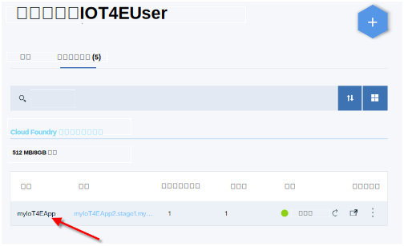

---

copyright:
  years: 2016
lastupdated: "2016-11-29"

---

<!-- Common attributes used in the template are defined as follows: -->
{:new_window: target="\_blank"}
{:shortdesc: .shortdesc}
{:screen:.screen}
{:codeblock:.codeblock}

# モバイル接続とセキュリティーの構成
{: #iot4e_configureMCA}

{{site.data.keyword.amafull}} を構成して、モバイル通信とセキュリティーを使用可能にします。このタスクは、サンプル・モバイル・アプリを使用するために必要であり、1 回のみ実行する必要があります。
{:shortdesc}

始める前に、{{site.data.keyword.Bluemix_notm}} 組織の {{site.data.keyword.iotelectronics}} Starter のインスタンスをデプロイする必要があります。
Starter のインスタンスをデプロイすると、{{site.data.keyword.amafull}} など、コンポーネント・アプリケーションとサービスが自動的にデプロイされます。

1. {{site.data.keyword.iotelectronics}} Starter をデプロイすると、スターター・アプリの「開始」タブが表示され、これらの指示の次の手順に進む必要があります。スターター・アプリが表示されない場合は、{{site.data.keyword.Bluemix_notm}} ダッシュボードを開き、スターター・アプリの名前をクリックして、{{site.data.keyword.iotelectronics}} スターター・アプリケーションを開始します。

    

2. **「アプリの表示 (View App)」** を右クリックして、**「リンク・ロケーションのコピー (Copy Link Location)」**を選択することによって、{{site.data.keyword.iotelectronics}} Web アプリの URL をコピーします。

3. **「接続 (Connections)」**タブで {{site.data.keyword.amashort}} サービスをクリックして開きます。

3. {{site.data.keyword.amashort}} の「認証 (Authentication)」ページで**「オン (On)」**をクリックして、認証を使用可能にします。

4. **「カスタム」**セクションで、次の認証資格情報を入力します。

    - **レルム名 (Realm name)**: `myRealm`

    - **カスタム ID プロバイダーの URL (Custom Identity Provider Url)**: 最初の手順でコピーした API アプリケーションの URL を次の形式で貼り付けます。**https://<*myIoT4eStarterApp*>.mybluemix.net**。  

    **重要:** コピーした値が `http` を使用している場合でも、URL はセキュアなプロトコル `https` を使用するようにしてください。

    - **Web アプリケーション・リダイレクト URI (Your Web Application Redirect URIs)**: このフィールドはブランクのままにします。

   」ページ")  

5. 設定を保存します。これで、{{site.data.keyword.iotelectronics}} サービス・コンソール、または {{site.data.keyword.Bluemix_notm}} コンソールに戻ることができます。
