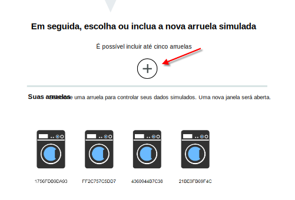

---

copyright:
  years: 2016
lastupdated: "2016-11-29"

---

{:new_window: target="\_blank"}

{:shortdesc: .shortdesc}

# Usando o aplicativo iniciador
Crie dispositivos simulados no app iniciador do {{site.data.keyword.iotelectronics_full}}. Experimente como um fabricante corporativo pode monitorar dispositivos conectados ao {{site.data.keyword.iot_short_notm}}. Interaja manualmente com o dispositivo simulado para acionar alertas, notificações e ações.
{:shortdesc}

## Abrindo o aplicativo iniciador
{: #iot4e_openApp}

1. Em seu painel do {{site.data.keyword.Bluemix_notm}}, inicie o seu aplicativo iniciador {{site.data.keyword.iotelectronics}} clicando no tile do aplicativo iniciador.

    

2. Espere a mensagem de status *Seu aplicativo está em execução* no cabeçalho e, em seguida, clique em **Visualizar aplicativo** para exibir o aplicativo iniciador.  

    

## Criando dispositivos simulados
{: #create_sim}

No aplicativo iniciador, é possível criar e controlar dispositivos simulados como o fabricante do dispositivo ou como um consumidor. Status e dados do evento para esses dispositivos simulados são
armazenados e podem ser visualizados no {{site.data.keyword.iot_full}}.

1. Selecione uma das seguintes opções:
    - **Conectar e gerenciar dispositivos simulados** para criar dispositivos simulados como o fabricante do dispositivo
    - **Controlar remotamente os seus dispositivos conectados** para criar dispositivos simulados e se conectar com o [aplicativo móvel
de amostra](iotelectronics_config_mobile.html) como o proprietário de dispositivo.

    

2. Role até a seção rotulada **Em seguida, escolha ou inclua a nova arruela simulada** e clique no ícone +. Uma nova lavadora é criada.

    

3. Para visualizar os detalhes de sua arruela, comandos de emissão e falhas de causa, clique em uma arruela.

  

# Links Relacionados
{: #rellinks}

## Documentação da API
{: #api}
* [API do {{site.data.keyword.iotelectronics}}](http://ibmiotforelectronics.mybluemix.net/public/iot4eregistrationapi.html)
* [API do {{site.data.keyword.iot_short}}](https://developer.ibm.com/iotfoundation/recipes/api-documentation/)

## Componentes
{: #general}

* [{{site.data.keyword.iotelectronics}} documentação](iotelectronics_overview.html)
* [{{site.data.keyword.iot_full}} documentação](https://console.ng.bluemix.net/docs/services/IoT/index.html)
*  [{{site.data.keyword.amashort}} documentação](https://console.ng.bluemix.net/docs/services/mobileaccess/overview.html)
* [{{site.data.keyword.sdk4nodefull}} documentação](https://console.ng.bluemix.net/docs/runtimes/nodejs/index.html#nodejs_runtime)

## Amostra
{: #samples}
* [Aplicativo móvel de
amostra](https://console.ng.bluemix.net/docs/starters/IotElectronics/iotelectronics_config_mobile.html)
