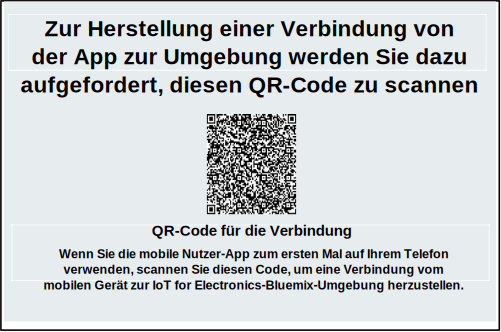

---

copyright:
  years: 2016

---

<!-- Common attributes used in the template are defined as follows: -->
{:new_window: target="_blank"}
{:shortdesc: .shortdesc}
{:screen:.screen}
{:codeblock:.codeblock}

# Mobile App verwenden
{: #iot4e_using_mobile}
*Letzte Aktualisierung: 14. Juni 2016*
{: .last-updated}

Beginnen Sie mit der mobilen App von {{site.data.keyword.iotelectronics_full}}, um zu lernen, wie Sie Alerts empfangen, Befehle senden und den Status der verbundenen Appliances überprüfen können.
{:shortdesc}

Führen Sie die folgenden Tasks aus: 
1. [Laden Sie die mobile App herunter](#iot4e_downloadmobile). 
2. [Konfigurieren Sie {{site.data.keyword.amafull}}](#iot4e_configureMCA). 
3. [Verbinden Sie das mobile Gerät mit der {{site.data.keyword.iotelectronics}}-Umgebung](#iot4e_connecting_mobile). 
4. [Registrieren Sie eine Appliance auf dem mobilen Gerät und steuern Sie sie](#iot4e_adding_appliance). 

 ## Mobile Anwendung herunterladen
 {: #iot4e_downloadmobile}
Wenn Sie die mobile App abrufen möchten, laden Sie sie vom Apple App Store herunter und installieren Sie auf Ihrem Telefon. Öffnen Sie im Telefon den App Store und suchen Sie nach "ibm iot". Wählen Sie **IBM IoT for Electronics** aus und installieren Sie diese App. 

 Alternativ können Sie sie auch über [iTunes](https://itunes.apple.com/us/app/ibm-iot-for-electronics/id1103404928?ls=1&mt=8) installieren. 

## {{site.data.keyword.amashort}} konfigurieren
{: #iot4e_configureMCA}

Damit Sie eine Verbindung zur mobilen App herstellen können, müssen Sie vorher {{site.data.keyword.amafull}} konfigurieren.   

  1. Öffnen Sie in der Registerkarte **Verbindungen** in {{site.data.keyword.iotelectronics}} die Anwendung {{site.data.keyword.amashort}}. (Sie können auch über das {{site.data.keyword.Bluemix_notm}}-Dashboard auf die Anwendung zugreifen.)   

     

  2. Klicken Sie im Abschnitt **Angepasst** auf die Option **Konfigurieren**. 

      

  3. Geben Sie zur Authentifizierung die folgenden Berechtigungsnachweise ein: 
    - **Realmname**: Geben Sie **myRealm** ein. 
    - **URL**: Geben Sie die URL zum Angeben der Starter-App für {{site.data.keyword.iotelectronics}} im folgenden Format ein: **https://<*myIoT4eStarterApp*>.mybluemix.net**  

      **Tipp:** Stellen Sie sicher, dass Sie als Präfix in der URL `https://` verwenden. Die URL der Starter-App finden Sie, wenn Sie auf **Mobile Systemerweiterungen** klicken. 

    

  4. Speichern Sie die Einstellungen. 

## Mobile App mit {{site.data.keyword.iotelectronics}}-Umgebung verbinden
{: #iot4e_connecting_mobile}

Damit Sie die simulierten Anwendungen in der mobilen App anzeigen können, müssen Sie die mobile App mit der {{site.data.keyword.iotelectronics}}-Bluemix-Umgebung verbinden. 

Führen Sie die folgenden Schritte durch, um die mobile App zu verbinden: 

  1. Starten Sie auf dem Computer die Anwendung {{site.data.keyword.iotelectronics}} und klicken Sie auf **App anzeigen**, um die Starter-App anzuzeigen.   

    
  2. Wählen Sie **Verbundene Appliances über Fernzugriff steuern** aus. 

  

  3. Erstellen Sie mindestens eine Waschmaschine. Die mobile App kann erst verbunden werden, wenn eine Waschmaschine erstellt wurde. 

  4.	Blättern Sie zu dem QR-Code für die Verbindung und scannen Sie ihn mit dem mobilen Gerät. Der QR-Code für die Verbindung wird im Abschnitt mit der Bezeichnung `Zur Herstellung einer Verbindung von der App zur Umgebung werden Sie aufgefordert, diese QR-Code zu scannen` gesucht. 

   

  5. Geben Sie die Berechtigungsnachweise für die Anmeldung ein. Die Benutzer-ID kann eine beliebige Länge aufweisen. Notieren Sie die Anmeldeberechtigungsnachweise für zukünftige Sitzungen.   

## Appliance auf mobilem Gerät registrieren und steuern
{: #iot4e_adding_appliance}

Damit Sie den Appliancestatus anzeigen und Benachrichtigungen empfangen können, müssen Sie die Appliance vorher mithilfe der mobilen App registrieren. 

Führen Sie zum Registrieren einer Appliance die folgenden Schritte aus: 

  1. Blättern Sie auf dem Computer zur simulierten Waschmaschine und klicken Sie auf diese, um ihre Daten und den QR-Code für die Appliance anzuzeigen. 

   

  2.	Scannen Sie mit dem mobilen Gerät den QR-Code der Waschmaschine, um die Waschmaschine auf dem Mobiltelefon zu registrieren. Der Status der Waschmaschine wird auf dem Mobiltelefon angezeigt. 

  3. Wählen Sie auf dem Computer ein Problem für die Waschmaschine aus, zum Beispiel einen Platinenfehler oder starke Vibrationen. Das Problem führt dazu, dass ein Alert an das Mobiltelefon gesendet wird. 
