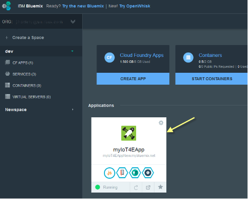
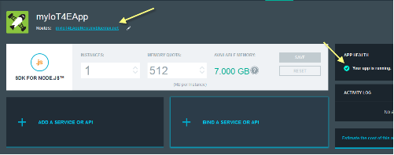
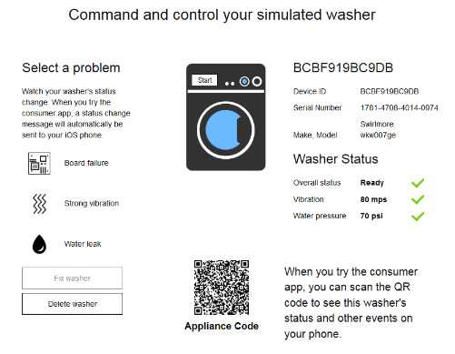

---

copyright:
  2016

---

{:new_window: target="\_blank"}

{:shortdesc: .shortdesc}

# Utilisation de l'application de démarrage 
*Dernière mise à jour : 15 septembre 2016*
{: .last-updated}

Créez des appareils simulés dans l'application de démarrage {{site.data.keyword.iotelectronics_full}}. Découvrez comment un fabricant peut contrôler les appareils connectés à {{site.data.keyword.iot_short_notm}}. Interagissez manuellement avec l'appareil simulé
pour déclencher des alertes, des notifications et des actions.
{:shortdesc}

## Ouverture de l'application de démarrage 
{: #iot4e_openAppMain}

Comme la méthode d'ouverture de l'application de démarrage varie légèrement selon la version de la console
{{site.data.keyword.Bluemix_notm}} que vous utilisez, lisez les instructions concernant votre version.

Vous pouvez identifier la version que vous utilisez en recherchant les options suivantes : 
  - [Nouvelle version de {{site.data.keyword.Bluemix_notm}}](#iot4e_openApp). Si vous utilisez la nouvelle version de
{{site.data.keyword.Bluemix_notm}}, la section d'en-tête ne comporte *pas* de lien permettant d'**essayer la nouvelle interface Bluemix**. 
  - [Version classique de {{site.data.keyword.Bluemix_notm}}](#iot4e_openApp_c). Si vous utilisez la version classique de
{{site.data.keyword.Bluemix_notm}}, l'option permettant d'**essayer la nouvelle interface Bluemix** apparaît dans la section d'en-tête.
  

**Astuce :** pour passer à la version classique de {{site.data.keyword.Bluemix_notm}}, cliquez sur votre nom d'utilisateur
dans la section d'en-tête, puis faites défiler la page et cliquez sur **Basculer sur classique**. Pour passer à la nouvelle version de
{{site.data.keyword.Bluemix_notm}}, cliquez sur le lien permettant d'**essayer la nouvelle interface Bluemix**
dans la section
d'en-tête. 

### Ouverture de l'application de démarrage dans la nouvelle version de {{site.data.keyword.Bluemix_notm}}

{: #iot4e_openApp}
1. Dans votre tableau de bord {{site.data.keyword.Bluemix_notm}}, lancez votre application de démarrage
{{site.data.keyword.iotelectronics}} en cliquant sur sa vignette.

    

2. Patientez jusqu'à ce que le message de statut *Votre application est en cours d'exécution* s'affiche dans l'en-tête, puis cliquez
sur
**Afficher l'application** pour afficher l'application de démarrage.   

    

### Ouverture de l'application de démarrage dans la version classique de {{site.data.keyword.Bluemix_notm}}

{: #iot4e_openApp_c}

1. Dans votre tableau de bord {{site.data.keyword.Bluemix_notm}}, lancez votre application de démarrage
{{site.data.keyword.iotelectronics}} en cliquant sur sa vignette.

    

2. Patientez jusqu'à ce que le message de statut *Votre application est en cours d'exécution* apparaisse dans la section Santé de
l'application, puis, dans la fenêtre principale, cliquez sur l'adresse URL **Routes** correspondant au nom d'application pour afficher
l'application de démarrage.
  

    

## Création d'appareils simulés
{: #iot4eCreateAppliances}

Dans l'application de démarrage, vous pouvez créer et contrôler des appareils simulés en tant que fabricant ou consommateur d'appareils.
Le statut et les données d'événement pour ces appareils simulés sont stockés et peuvent être affichés dans {{site.data.keyword.iot_full}}.

1. Sélectionnez l'une des options suivantes : 
    - **Connectez et gérez les appareils simulés** pour créer des appareils simulés en tant que fabricant d'appareils. 
    - **Contrôlez à distance vos appareils connectés** pour créer des appareils simulés et vous connecter au
[modèle d'application mobile](iotelectronics_config_mobile.html) en tant que propriétaire d'appareil.

    

2. Faites défiler la page pour accéder à la section intitulée **Ensuite, choisissez ou ajoutez un nouveau lave-linge simulé**,
puis cliquez sur l'icône +. Un lave-linge est créé.

    

3. Pour afficher les détails de votre lave-linge, émettre des commandes et générer des pannes, cliquez sur un lave-linge.

  

# Liens connexes
{: #rellinks}

## Documentation sur les API
{: #api}
* [{{site.data.keyword.iotelectronics}} API](http://ibmiotforelectronics.mybluemix.net/public/iot4eregistrationapi.html)
* [{{site.data.keyword.iot_short}} API](https://developer.ibm.com/iotfoundation/recipes/api-documentation/)

## Composants
{: #general}

* [Documentation {{site.data.keyword.iotelectronics}}](iotelectronics_overview.html)
* [Documentation {{site.data.keyword.iot_full}}](https://new-console.ng.bluemix.net/docs/services/IoT/index.html)
*  [Documentation {{site.data.keyword.amashort}}](https://new-console.ng.bluemix.net/docs/services/mobileaccess/overview.html)
* [Documentation {{site.data.keyword.sdk4nodefull}}](https://new-console.ng.bluemix.net/docs/runtimes/nodejs/index.html#nodejs_runtime)

## Exemples
{: #samples}
* [Application mobile exemple](https://new-console.ng.bluemix.net/docs/starters/IotElectronics/iotelectronics_config_mobile.html)
