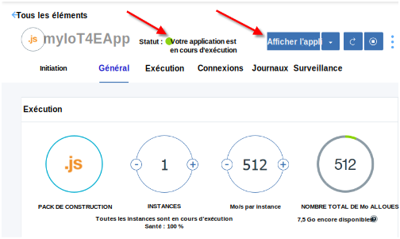

---

copyright:
  years: 2016
lastupdated: "2016-11-29"

---

{:new_window: target="\_blank"}

{:shortdesc: .shortdesc}

# Utilisation de l'application de démarrage
Créez des appareils simulés dans l'application de démarrage {{site.data.keyword.iotelectronics_full}}. Découvrez comment un fabricant peut contrôler les appareils connectés à {{site.data.keyword.iot_short_notm}}. Interagissez manuellement avec l'appareil simulé
pour déclencher des alertes, des notifications et des actions.
{:shortdesc}

## Ouverture de l'application de démarrage
{: #iot4e_openApp}

1. Dans votre tableau de bord {{site.data.keyword.Bluemix_notm}}, lancez votre application de démarrage
{{site.data.keyword.iotelectronics}} en cliquant sur sa vignette.

    

2. Patientez jusqu'à ce que le message de statut *Votre application est en cours d'exécution* s'affiche dans l'en-tête, puis cliquez
sur
**Afficher l'application** pour afficher l'application de démarrage.  

    

## Création d'appareils simulés
{: #create_sim}

Dans l'application de démarrage, vous pouvez créer et contrôler des appareils simulés en tant que fabricant ou consommateur d'appareils. Le statut et les données d'événement pour ces appareils simulés sont stockés et peuvent être affichés dans {{site.data.keyword.iot_full}}.

1. Sélectionnez l'une des options suivantes :
    - **Connectez et gérez les appareils simulés** pour créer des appareils simulés en tant que fabricant d'appareils.
    - **Contrôlez à distance vos appareils connectés** pour créer des appareils simulés et vous connecter au
[modèle d'application mobile](iotelectronics_config_mobile.html) en tant que propriétaire d'appareil.

    

2. Faites défiler la page pour accéder à la section intitulée **Ensuite, choisissez ou ajoutez un nouveau lave-linge simulé**,
puis cliquez sur l'icône +. Un lave-linge est créé.

    

3. Pour afficher les détails de votre lave-linge, émettre des commandes et générer des pannes, cliquez sur un lave-linge.

  

# Liens connexes
{: #rellinks}

## Documentation sur les API
{: #api}
* [{{site.data.keyword.iotelectronics}} API](http://ibmiotforelectronics.mybluemix.net/public/iot4eregistrationapi.html)
* [{{site.data.keyword.iot_short}} API](https://developer.ibm.com/iotfoundation/recipes/api-documentation/)

## Composants
{: #general}

* [Documentation d'{{site.data.keyword.iotelectronics}}](iotelectronics_overview.html)
* [Documentation d'{{site.data.keyword.iot_full}}](https://console.ng.bluemix.net/docs/services/IoT/index.html)
*  [Documentation de {{site.data.keyword.amashort}}](https://console.ng.bluemix.net/docs/services/mobileaccess/overview.html)
* [Documentation d'{{site.data.keyword.sdk4nodefull}}](https://console.ng.bluemix.net/docs/runtimes/nodejs/index.html#nodejs_runtime)

## Exemples
{: #samples}
* [Modèle d'application mobile](https://console.ng.bluemix.net/docs/starters/IotElectronics/iotelectronics_config_mobile.html)
