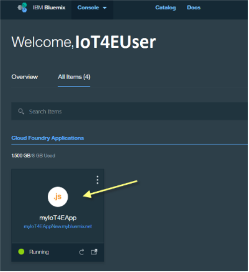
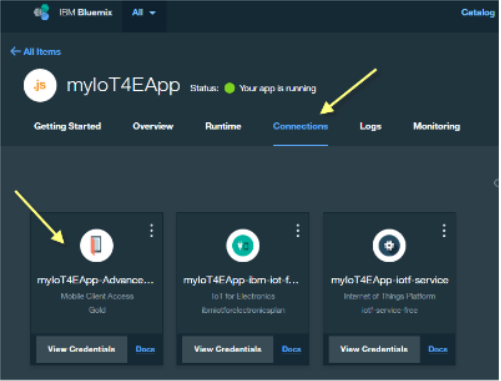
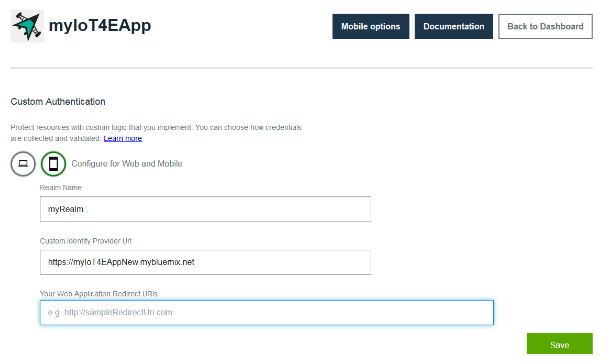
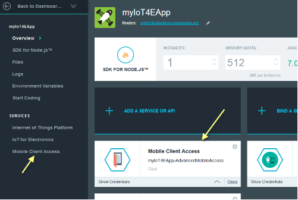
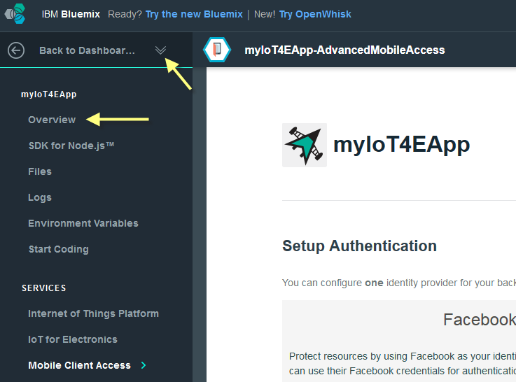

---

copyright:
  2016

---

<!-- Common attributes used in the template are defined as follows: -->
{:new_window: target="\_blank"}
{:shortdesc: .shortdesc}
{:screen:.screen}
{:codeblock:.codeblock}

# Configuration de la sécurité et de la connectivité mobile 
{: #iot4e_configureMCA}

*Dernière mise à jour : 19 septembre 2016*
{: .last-updated}

Activez la sécurité et les communications mobiles en configurant {{site.data.keyword.amafull}}. Vous devez effectuer cette tâche pour pouvoir
utiliser le modèle d'application mobile, mais il suffit de l'effectuer une fois.
{:shortdesc}

## Avant de commencer 

Avant de commencer, vous devez effectuer les tâches suivantes :
  - Déployez une instance du module de démarrage {{site.data.keyword.iotelectronics}} dans votre organisation
{{site.data.keyword.Bluemix_notm}}. Cette opération entraîne le déploiement automatique des services et des applications de composant, y
compris {{site.data.keyword.amafull}}.

  - Comme le processus de configuration varie légèrement selon la version de la console {{site.data.keyword.Bluemix_notm}} que vous
utilisez, lisez les instructions concernant votre version.

  Vous pouvez identifier la version que vous utilisez en recherchant les options suivantes : 
    - [Nouvelle version de {{site.data.keyword.Bluemix_notm}}](#configMCAnew). Si vous utilisez la nouvelle version de
{{site.data.keyword.Bluemix_notm}}, l'option **Accédez à la version classique** apparaît dans la section d'en-tête du tableau de
bord.

    - [Version classique de {{site.data.keyword.Bluemix_notm}}](#configMCAclassic). Si vous utilisez la version
classique de {{site.data.keyword.Bluemix_notm}}, l'option permettant d'**essayer la nouvelle interface Bluemix**
apparaît dans la section d'en-tête.

## Configuration de {{site.data.keyword.amashort}} dans la nouvelle version de {{site.data.keyword.Bluemix_notm}} 
{: #configMCAnew}

  1. Si vous venez de déployer le module de démarrage {{site.data.keyword.iotelectronics}}, l'onglet Initiation de l'application de démarrage s'affiche, et vous pouvez passer à l'étape suivante de cette procédure. Si l'application de démarrage ne s'affiche pas, ouvrez votre tableau de bord {{site.data.keyword.Bluemix_notm}} et lancez votre application de démarrage {{site.data.keyword.iotelectronics}} en cliquant sur sa vignette.

    

  2. Dans l'onglet **Connexions**, cliquez sur le service {{site.data.keyword.amashort}} pour l'ouvrir. 

    

  3. Dans la page **Configuration de l'authentification**, localisez l'adresse URL de votre application de démarrage {{site.data.keyword.iotelectronics}} en cliquant sur **Options pour application mobile**. Copiez l'adresse URL qui se trouve dans la zone **Acheminer**. 

      

  4. Dans la **section Personnalisé de la page **Configuration de l'authentification**, cliquez sur **Configurer**.

       

  5. Entrez les données d'authentification suivantes, puis cliquez sur **Sauvegarder ** :
    - **Nom de domaine** : entrez **myRealm**.
    - **URL de fournisseur d'identité personnalisé** : entrez l'adresse URL que vous avez copiée précédemment afin d'identifier
votre application de démarrage {{site.data.keyword.iotelectronics}} au format suivant : **https://<*myIoT4eStarterApp*>.mybluemix.net**
    - **Vos URI de redirection d'application Web** : laissez cette zone vide. 

        

  6. Retournez dans l'onglet Connexions de la console de démarrage {{site.data.keyword.iotelectronics}} en cliquant sur le nom de
l'application de démarrage qui se trouve dans la section d'en-tête. 

   

## Configuration de {{site.data.keyword.amashort}} dans la version classique de {{site.data.keyword.Bluemix_notm}}

{: #configMCAclassic}

1. Dans votre tableau de bord {{site.data.keyword.Bluemix_notm}}, lancez votre application de démarrage {{site.data.keyword.iotelectronics}} en cliquant sur sa vignette.

    

2. Dans votre instance d'{{site.data.keyword.iotelectronics}}, cliquez sur le service {{site.data.keyword.amashort}} pour l'ouvrir.
   

  

2. Dans la page **Configuration de l'authentification**, localisez l'adresse URL de votre application de démarrage
{{site.data.keyword.iotelectronics}} en cliquant sur **Options pour application mobile**. Copiez l'adresse URL qui se trouve
dans la zone **Acheminer**. 

  

3. Dans la **section Personnalisé de la page **Configuration de l'authentification**, cliquez sur **Configurer**.

 

4. Entrez les données d'authentification suivantes, puis cliquez sur **Sauvegarder ** :
   - **Nom de domaine** : entrez **myRealm**.
   - **URL de fournisseur d'identité personnalisé** : entrez l'adresse URL que vous avez copiée précédemment afin d'identifier
votre application de démarrage {{site.data.keyword.iotelectronics}} au format suivant :
**https://<*myIoT4eStarterApp*>.mybluemix.net**
   - **Vos URI de redirection d'application Web** : laissez cette zone vide. 

    

5. Retournez dans l'onglet Connexions de la console de démarrage {{site.data.keyword.iotelectronics}} comme suit :

  1. Affichez le menu en cliquant sur la flèche double à côté de l'option **Retour au tableau de bord** dans
la section d'en-tête.

  2. Cliquez sur **Vue d'ensemble** pour retourner dans la console de démarrage.   

    

