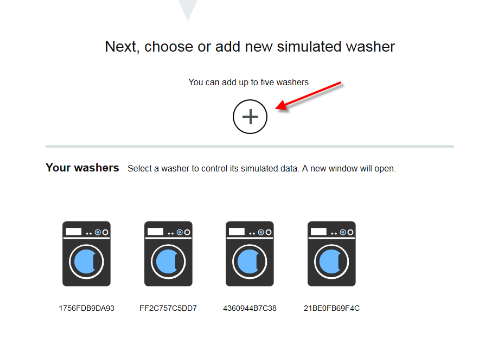
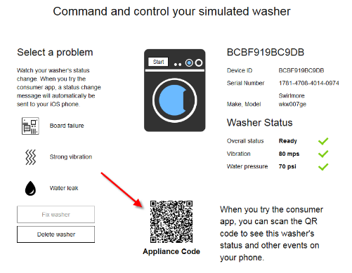

---

copyright:
  2016

---

<!-- Common attributes used in the template are defined as follows: -->
{:new_window: target="\_blank"}
{:shortdesc: .shortdesc}
{:screen:.screen}
{:codeblock:.codeblock}

# Utilisation de l'application mobile
{: #iot4e_using_mobile}
*Dernière mise à jour : 19 septembre 2016*
{: .last-updated}

Familiarisez-vous avec l'application mobile
{{site.data.keyword.iotelectronics_full}} pour voir comment vous
pouvez recevoir des alertes, envoyer des commandes et vérifier le statut de vos
appareils connectés.
{:shortdesc}

## Avant de commencer

Pour pouvoir utiliser l'application mobile, vous devez d'abord effectuer les tâches suivantes : 
  - Déployez une instance du module de démarrage {{site.data.keyword.iotelectronics}} dans votre organisation
{{site.data.keyword.Bluemix_notm}}. Cette opération entraîne le déploiement automatique des services et des applications de composant du module de
démarrage.

  - [Activez la sécurité et les communications mobiles](iotelectronics_config_mca.html) en configurant
{{site.data.keyword.amafull}}.

## Initiation à l'application mobile 
Pour vous initier à l'application mobile, effectuez les tâches suivantes : 
1. [Téléchargez l'application mobile](#iot4e_downloadmobile) sur votre périphérique mobile. 
2. [Connectez l'application mobile à l'environnement {{site.data.keyword.iotelectronics}}](#iot4e_connecting_mobile) et
enregistrez vos appareils.

 ### Téléchargement de l'application mobile
 {: #iot4e_downloadmobile}
 Pour obtenir l'application mobile, téléchargez-la et installez-la sur votre
téléphone depuis l'App store d'Apple.  Sur votre téléphone, ouvrez l'App store
et recherchez "ibm iot". Sélectionnez **IBM IoT for
Electronics** et installez l'application.

 Sinon, vous pouvez l'installer sur votre téléphone via [iTunes](https://itunes.apple.com/us/app/ibm-iot-for-electronics/id1103404928?ls=1&mt=8).

### Connexion de l'application mobile 
{: #iot4e_connecting_mobile}

Pour connecter l'application mobile à votre environnement et enregistrer vos appareils, procédez comme suit :

1. Ouvrez votre application de démarrage {{site.data.keyword.itoelectronics}}. Pour des instructions, voir
[Ouverture de l'application de démarrage](iot4ecreatingappliances.html#iot4e_openAppMain).

2. Sélectionnez **Contrôlez à distance vos appareils connectés**.

    

3. Créez un ou plusieurs lave-linges en faisant défiler la page jusqu'à la section intitulée **Ensuite, choisissez ou ajoutez un nouveau
lave-linge simulé**, puis cliquez sur l'icône +. Un lave-linge est créé.

    

4.	Faites défiler l'écran jusqu'au code Quick Response de connexion et
scannez-le à l'aide de votre périphérique mobile. Le code Quick Response de
connexion se trouve dans la section intitulée **Pour connecter l'application à l'environnement, vous devez scanner ce code Quick Response**.

  

5. Sur votre périphérique mobile, entrez vos données d'identification. Votre ID utilisateur et votre
mot de passe ne sont pas limités en longueur. Mémorisez vos données
d'identification pour les sessions ultérieures. A présent, votre périphérique mobile est enregistré dans votre environnement
{{site.data.keyword.iotelectronics}}, et vous pouvez enregistrer des appareils individuels.

6. Sur votre ordinateur, accédez à un lave-linge simulé et cliquez
dessus pour afficher ses données et son code Quick Response d'appareil.

  

7.	Utilisez votre périphérique mobile pour scanner le code Quick Response du lave-linge. Le lave-linge est maintenant enregistré, et son statut
s'affiche sur votre téléphone mobile.

#### Etapes suivantes
A présent, vous pouvez afficher des alertes et contrôler le lave-linge en utilisant votre périphérique mobile. Essayez comme suit :

  - Sur votre ordinateur, sélectionnez un problème lié au lave-linge,
par exemple, Défaillance de carte ou Fortes vibrations. Le problème envoie
alors une alerte à votre téléphone portable.
  - Sur votre périphérique mobile, cliquez sur l'option de **lancement d'une lessive** pour démarrer la machine. Le statut du lave-linge change sur votre
ordinateur et passe par tous les cycles de lavage.

