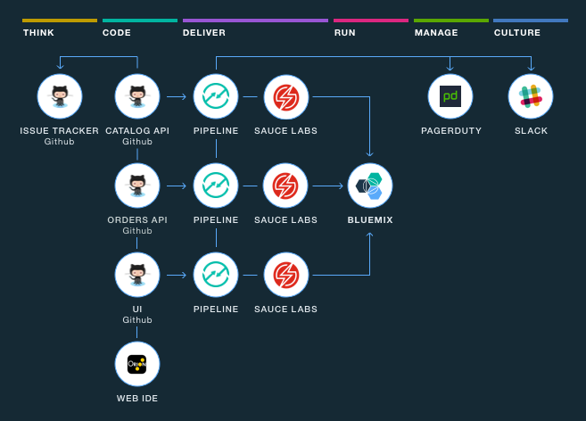

---

copyright:
  years: 2016

---
 
{:shortdesc: .shortdesc}
{:new_window: target="_blank"}

# ツールチェーン概説 (試験的) 
{: #toolchains_getting_started}

最終更新日: 2016 年 8 月 17 日
{: .last-updated}  

ツールチェーンは、{{site.data.keyword.Bluemix}} の Public 環境および Dedicated 環境で使用可能です。ツールチェーンの作成方法には、テンプレートを使用した作成と、アプリからの作成の 2 とおりの方法があります。
{: shortdesc}

**重要**: この機能は試験的なものです。ツールチェーンは変更される可能性があり、変更により前のバージョンとの互換性がなくなる場合もあります。実稼働環境での使用は推奨されません。{{site.data.keyword.Bluemix_notm}} Public では、ツールチェーンは「米国南部」地域でのみ使用可能です。

##ツールチェーンの概要: Public
{: #getting_started_public}

各ツールチェーンは特定の組織と関連付けられ、組織に関連付けられたツールチェーンには、その組織のメンバーであるすべてのユーザーがアクセスできます。ツールチェーンを作成する前に、そのツールチェーンを作成したい組織で作業していることを確認してください。別の組織に切り替えるには、メニュー・バーの「**{{site.data.keyword.avatar}}**」アイコン  をクリックして「アカウントとサポート」ウィジェットを開きます。

###テンプレートからのツールチェーンの作成   
{: #creating_a_toolchain_from_a_template}

ツール統合の特定の集合を含むツールチェーンを作成するための開始点としてテンプレートを使用できます。

1. ツールチェーンを初めて作成する場合、組織でツールチェーンが有効になっていることを確認します。
   1. DevOps ダッシュボードを開き、**「ツールチェーン」**タブをクリックします。
   2. **「ツールチェーンを有効にする (Enable Toolchains)」**ボタンが表示されたら、それをクリックし、プロンプトに従ってツールチェーンを作成します。
   3. **「ツールチェーンを有効にする (Enable Toolchains)」**ボタンが表示されない場合、ツールチェーンは既に有効になっています。ステップ 2 に進みます。
1. DevOps ダッシュボードの**「ツールチェーン」**タブで、ツールチェーンを作成するために追加ボタン (+) をクリックします。
1. ツールチェーン・テンプレートをクリックします。例えば、オンライン・ストア・サンプルを使用してツールチェーンを作成するには、**「Microservices ツールチェーン」**をクリックします。 
1. 「ツールチェーン作成」ページで、作成しようとしているツールチェーンの図を検討します。この図には、ツールチェーン内の各ツール統合とそのライフサイクル・フェーズが示されます。次のイメージは図の例を示しています。この図には、ツールチェーンを作成するときに、そのツールチェーンに含まれる各ツール統合が示されます。

1. ツールチェーン設定のデフォルト情報を検討します。ツールチェーンの名前は、そのツールチェーンを {{site.data.keyword.Bluemix_notm}} 内で識別するためのものです。同じ名前のツールチェーンが既にあるか、または、別の名前を使用したい場合は、ツールチェーンの名前を変更してください。  
1. 「構成可能な統合 (Configurable Integrations)」セクションで、ツールチェーン用に構成したい各ツール統合を選択します。構成を必要としないツール統合もあります。ツール統合の構成について詳しくは、『[ツール統合の構成](../toolchains/toolchains_integrations.html){: new_window}』を参照してください。
1. **「作成」**をクリックします。以下のようないくつかのステップが自動的に実行されて、ツールチェーンがセットアップされます。

 * ツールチェーンが作成されます。
 * Delivery Pipeline ツール統合を構成した場合、パイプラインがトリガーされます。
 * Sauce Labs ツール統合を構成した場合、ジョブをパイプラインに追加してテストを実行するように Sauce Labs 統合が構成されます。
 * PagerDuty ツール統合を構成した場合、Slack で構成したチャネルに通知を送信するように PagerDuty 統合が構成されます。これらの通知はいつ問題が発生したのかを示します。
 * Slack ツール統合を構成した場合、Slack で構成したチャネルに通知を送信するように Slack 統合が構成されます。これらの通知は、例えば、`Connected with Project XYZ` (プロジェクト XYZ に接続しました)、`Pipeline Configured` (パイプラインが構成されました)、`Stage 'build' started` (「build」ステージを開始しました) など、デプロイメントの進行状況を示します。
 * GitHub ツール統合を構成した場合、GitHub アカウントにサンプル GitHub リポジトリーが複製されます。

###アプリからのツールチェーンの作成
{: #creating_a_toolchain_from_an_app}

ツールチェーンをアプリから作成することができます。ツールチェーンは、継続的な開発、デプロイ、モニタリングなどをサポートでき、アプリと関連付けられます。各アプリをツールチェーンと関連付けることができます。ツールチェーンの GitHub リポジトリーに変更をプッシュすると、パイプラインが自動的にアプリをビルドしてデプロイします。  

1. ツールチェーンを初めて作成する場合、組織でツールチェーンが有効になっていることを確認します。
   1. DevOps ダッシュボードを開き、**「ツールチェーン」**タブをクリックします。
   2. **「ツールチェーンを有効にする (Enable Toolchains)」**ボタンが表示されたら、それをクリックし、プロンプトに従ってツールチェーンを作成します。
   3. **「ツールチェーンを有効にする (Enable Toolchains)」**ボタンが表示されない場合、ツールチェーンは既に有効になっています。ステップ 2 に進みます。
1. アプリの「概要」ページの「継続的なデリバリー」タイルで、**「ツールチェーンの追加」**をクリックします。あるいは、{{site.data.keyword.Bluemix_notm}} クラシック・エクスペリエンスでは、アプリの「概要」ページの右上隅にある**「ツールチェーンの追加」**をクリックします。アプリは、アプリ・スターター・コードが取り込まれた新規 GitHub リポジトリーからの継続的なデリバリー用に構成されます。
1. 「ツールチェーン作成」ページで、作成しようとしているツールチェーンの図を検討します。この図には、ツールチェーン内の各ツール統合とそのライフサイクル・フェーズが示されます。
1. ツールチェーン設定のデフォルト情報を検討します。ツールチェーンの名前は、そのツールチェーンを {{site.data.keyword.Bluemix_notm}} 内で識別するためのものです。同じ名前のツールチェーンが既にあるか、または、別の名前を使用したい場合は、ツールチェーンの名前を変更してください。
1. 「構成可能な統合 (Configurable Integrations)」セクションで、ツールチェーン用に構成したい各ツール統合を選択します。構成を必要としないツール統合もあります。ツール統合の構成について詳しくは、『[ツール統合の構成](../toolchains/toolchains_integrations.html){: new_window}』を参照してください。
1. **「作成」**をクリックします。以下のようないくつかのステップが自動的に実行されて、ツールチェーンがセットアップされます。

 * ツールチェーンが作成されます。
 * Delivery Pipeline ツール統合を構成した場合、パイプラインがトリガーされます。
 * Sauce Labs ツール統合を構成した場合、ジョブをパイプラインに追加してテストを実行するように Sauce Labs 統合が構成されます。
 * PagerDuty ツール統合を構成した場合、Slack で構成したチャネルに通知を送信するように PagerDuty 統合が構成されます。これらの通知はいつ問題が発生したのかを示します。
 * Slack ツール統合を構成した場合、Slack で構成したチャネルに通知を送信するように Slack 統合が構成されます。これらの通知は、例えば、`Connected with Project XYZ` (プロジェクト XYZ に接続しました)、`Pipeline Configured` (パイプラインが構成されました)、`Stage 'build' started` (「build」ステージを開始しました) など、デプロイメントの進行状況を示します。
 * GitHub ツール統合を構成した場合、GitHub アカウントにサンプル GitHub リポジトリーが複製されます。

##ツールチェーンの概要: Dedicated
{: #getting_started_dedicated}

各ツールチェーンは特定の組織と関連付けられ、組織に関連付けられたツールチェーンには、その組織のメンバーであるすべてのユーザーがアクセスできます。ツールチェーンを作成する前に、メニュー・バーの「**{{site.data.keyword.avatar}}**」アイコン  をクリックして「アカウントとサポート」ウィジェットを開き、作業している組織を確認してください。その組織が、ツールチェーンを作成したい組織ではない場合、別の組織に切り替えてください。

###テンプレートからのツールチェーンの作成   
{: #creating_a_toolchain_from_a_template_dedicated}

ツール統合の特定の集合を含むツールチェーンを作成するための開始点としてテンプレートを使用できます。

1. ツールチェーンを初めて作成する場合、組織でツールチェーンが有効になっていることを確認します。
   1. DevOps ダッシュボードを開き、**「ツールチェーン」**タブをクリックします。
   2. **「ツールチェーンを有効にする (Enable Toolchains)」**ボタンが表示されたら、それをクリックし、プロンプトに従ってツールチェーンを作成します。
   3. **「ツールチェーンを有効にする (Enable Toolchains)」**ボタンが表示されない場合、ツールチェーンは既に有効になっています。ステップ 2 に進みます。
1. {{site.data.keyword.Bluemix_notm}} ダッシュボードの**「DEVOPS」**タブで、ツールチェーンを作成するために追加ボタン (+) をクリックします。
1. ツールチェーン・テンプレートをクリックします。例えば、新規 Cloud Foundry アプリをデプロイするための単純なツールチェーンを作成するには、**「Simple Cloud Foundry ツールチェーン」**をクリックします。 
1. 「ツールチェーン作成」ページで、作成しようとしているツールチェーンの図を検討します。この図には、ツールチェーン内の各ツール統合とそのライフサイクル・フェーズが示されます。次のイメージは図の例を示しています。この図には、ツールチェーンを作成するときに、そのツールチェーンに含まれる各ツール統合が示されます。

1. ツールチェーン設定のデフォルト情報を検討します。ツールチェーンの名前は、そのツールチェーンを {{site.data.keyword.Bluemix_notm}} 内で識別するためのものです。同じ名前のツールチェーンが既にあるか、または、別の名前を使用したい場合は、ツールチェーンの名前を変更してください。  
1. 「構成可能な統合 (Configurable Integrations)」セクションで、ツールチェーン用に構成したい各ツール統合を選択します。構成を必要としないツール統合もあります。ツール統合の構成について詳しくは、『[ツール統合の構成](../toolchains/toolchains_integrations.html){: new_window}』を参照してください。
1. **「作成」**をクリックします。以下のようないくつかのステップが自動的に実行されて、ツールチェーンがセットアップされます。

 * ツールチェーンが作成されます。
 * Delivery Pipeline ツール統合を構成した場合、パイプラインがトリガーされます。
 * GitHub Enterprise ツール統合を構成した場合、GitHub Enterprise アカウントにサンプル GitHub Enterprise リポジトリーが複製されます。

###アプリからのツールチェーンの作成
{: #creating_a_toolchain_from_an_app_dedicated}

ツールチェーンをアプリから作成することができます。ツールチェーンは、継続的な開発、デプロイ、モニタリングなどをサポートでき、アプリと関連付けられます。各アプリをツールチェーンと関連付けることができます。ツールチェーンの GitHub Enterprise リポジトリーに変更をプッシュすると、パイプラインが自動的にアプリをビルドしてデプロイします。  

1. ツールチェーンを初めて作成する場合、組織でツールチェーンが有効になっていることを確認します。
   1. DevOps ダッシュボードを開き、**「ツールチェーン」**タブをクリックします。
   2. **「ツールチェーンを有効にする (Enable Toolchains)」**ボタンが表示されたら、それをクリックし、プロンプトに従ってツールチェーンを作成します。
   3. **「ツールチェーンを有効にする (Enable Toolchains)」**ボタンが表示されない場合、ツールチェーンは既に有効になっています。ステップ 2 に進みます。
1. アプリの「概要」ページの右上隅にある**「ツールチェーンの追加」**をクリックします。アプリは、アプリ・スターター・コードが取り込まれた新規 GitHub Enterprise リポジトリーからの継続的なデリバリー用に構成されます。
1. 「ツールチェーン作成」ページで、作成しようとしているツールチェーンの図を検討します。この図には、ツールチェーン内の各ツール統合とそのライフサイクル・フェーズが示されます。
1. ツールチェーン設定のデフォルト情報を検討します。ツールチェーンの名前は、そのツールチェーンを {{site.data.keyword.Bluemix_notm}} 内で識別するためのものです。同じ名前のツールチェーンが既にあるか、または、別の名前を使用したい場合は、ツールチェーンの名前を変更してください。
1. 「構成可能な統合 (Configurable Integrations)」セクションで、ツールチェーン用に構成したい各ツール統合を選択します。構成を必要としないツール統合もあります。ツール統合の構成について詳しくは、『[ツール統合の構成](../toolchains/toolchains_integrations.html){: new_window}』を参照してください。
1. **「作成」**をクリックします。以下のようないくつかのステップが自動的に実行されて、ツールチェーンがセットアップされます。

 * ツールチェーンが作成されます。
 * Delivery Pipeline ツール統合を構成した場合、パイプラインがトリガーされます。
 * GitHub Enterprise ツール統合を構成した場合、GitHub Enterprise アカウントにサンプル GitHub Enterprise リポジトリーが複製されます。

##ツールチェーンの表示
{: #viewing_a_toolchain}

ツールチェーンおよびそのツール統合の構成が終わったら、「ツール統合 (Tool Integrations)」ページでツールチェーンのビジュアル表示を見ることができます。

* {{site.data.keyword.Bluemix_notm}} Public を使用している場合、DevOps ダッシュボードの**「ツールチェーン」**タブでツールチェーンをクリックして、そのツールチェーンの「ツール統合 (Tool Integrations)」ページを開きます。あるいは、アプリの「概要」ページの「継続的なデリバリー」タイルで、**「ツールチェーンの表示」**をクリックします。次に、**「ツール統合 (Tool Integrations)」**をクリックします。 
   
* {{site.data.keyword.Bluemix_notm}} Dedicated を使用している場合、ダッシュボードの**「DEVOPS」**タブでツールチェーンをクリックして、そのツールチェーンの「ツール統合 (Tool Integrations)」ページを開きます。あるいは、アプリの「概要」ページの右上隅で**「ツールチェーンの表示」**をクリックします。

* ツールチェーン内のツール統合にアクセスするには、そのツールのタイルをクリックします。 
 
 **ヒント**: 複数の GitHub リポジトリーまたは GitHub Enterprise リポジトリーがある場合、各リポジトリーはそれぞれ固有のタイルで表されるため、同じツール統合に対して複数のタイルが存在することがあります。

 <!-- The toolchain in the following image is an example. When you create your own toolchain, the visual representation of the toolchain shows the tool integrations that you configure.
 -->

# 関連リンク
{: #rellinks}

## チュートリアルおよびサンプル
{: #samples}

* [Create an application with three microservices](https://www.ibm.com/devops/method/tutorials/tutorial_microservices_part1){:new_window}
* [Create a toolchain from a template on {{site.data.keyword.Bluemix_notm}} Dedicated (Experimental)](https://www.ibm.com/devops/method/tutorials/tutorial_dedicated_toolchain_template_flow){:new_window}
* [Create a toolchain from an app on {{site.data.keyword.Bluemix_notm}} Dedicated (Experimental)](https://www.ibm.com/devops/method/tutorials/tutorial_dedicated_toolchain_app_flow){:new_window}

## 関連リンク
{: #general}

* [Microservices toolchain (Experimental)](https://www.ibm.com/devops/method/toolchains/microservices_toolchain){:new_window}
* [Simple toolchain (Experimental)](https://www.ibm.com/devops/method/toolchains/simple_toolchain){:new_window}
* [IBM Bluemix Garage Method](https://www.ibm.com/devops/method){:new_window}
