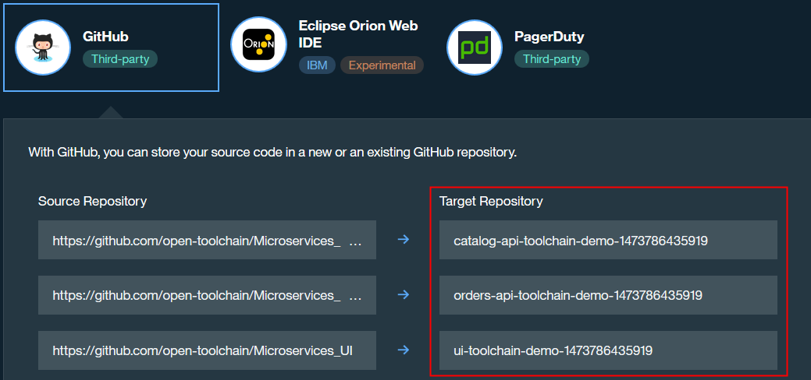

---

copyright:
  years: 2016

---

{:new_window: target="_blank"}
{:shortdesc: .shortdesc}
{:screen:.screen}
{:codeblock:.codeblock}

# 配置工具集成
{: #integrations}

上次更新时间：2016 年 9 月 13 日
{: .last-updated}

您可以在创建工具链时配置支持开发、部署和操作任务的工具集成，或者您可以添加并配置工具集成，以定制现有工具链。  
{:shortdesc}

**重要信息**：此功能是试验性的。工具链可能不稳定，并且可能会发生变化而与较低版本不兼容。因此，不建议在生产环境中使用工具链。在 {{site.data.keyword.Bluemix_notm}} Public 上，工具链只能在美国（南部）区域中使用。

可向工具链添加和配置的工具集成根据是要在 {{site.data.keyword.Bluemix_notm}} Public 上还是 {{site.data.keyword.Bluemix_notm}} Dedicated 上使用工具链而有所不同。

*表 1. 可用于 {{site.data.keyword.Bluemix_notm}} Public 和 Dedicated* 上工具链的工具集成

|工具集成 |可在 {{site.data.keyword.Bluemix_notm}} Public 上使用	|可在 {{site.data.keyword.Bluemix_notm}} Dedicated 上使用|
|:----------|:------------------------------|:------------------|
|{{site.data.keyword.deliverypipeline}} 		|是	   	|是  		|
|{{site.data.keyword.DRA_short}} 		|是		|否			|
|Eclipse Orion {{site.data.keyword.webide}}		|是		|是			|
|GitHub		|是		|否		|
|Dedicated GitHub Enterprise			|否		|是		|
|PagerDuty			|是		|否		|
|Sauce Labs		|是		|否		|
|Slack			|是		|否		|

**提示**：如果要在 {{site.data.keyword.Bluemix_notm}} Public 上开始使用自己的源代码进行开发，请先配置 GitHub 工具集成，然后配置 {{site.data.keyword.deliverypipeline}}。如果要在 {{site.data.keyword.Bluemix_notm}} Dedicated 上开始使用自己的代码进行开发，请先配置 {{site.data.keyword.ghe_short}} 工具集成，然后配置 {{site.data.keyword.deliverypipeline}}。 


## 配置 Delivery Pipeline
{: #deliverypipeline}

{{site.data.keyword.deliverypipeline}} 可通过检索输入和运行作业的阶段序列（如构建、测试和部署），自动持续部署项目。 

配置 {{site.data.keyword.deliverypipeline}} 以自动持续构建、测试和部署应用程序： 

1. 如果要在创建工具链时配置此工具集成，请在“可配置的集成”部分中，单击 **Delivery Pipeline**。根据使用的模板，可能会有不同的字段可用。查看缺省字段值，并根据需要更改这些设置。
1. 如果在 {{site.data.keyword.Bluemix_notm}} Public 上具有工具链，并且要向其添加此工具集成，请在 DevOps 仪表板的**工具链**选项卡上，单击该工具链来打开其“工具集成”页面。或者，在应用程序“概述”页面的“持续交付”磁贴上，单击**查看工具链**。然后，单击**工具集成**。如果是在 {{site.data.keyword.Bluemix_notm}} Dedicated 上使用工具链，请在“仪表板”的 **DEVOPS** 选项卡上，单击该工具链来打开其“工具集成”页面。或者，单击应用程序的“概述”页面右上角的**查看工具链**。然后，单击**工具集成**。 
1. 单击“添加”按钮 (+)。
1. 在“工具集成”部分中，单击 **Delivery Pipeline**。
1. 指定新管道的名称。
1. 如果计划使用管道来部署用户界面，请选中**可查看的应用程序**复选框。管道创建的所有应用程序都将显示在工具链的“工具集成”页面上的**查看应用程序**列表中。
1. 单击**创建集成**以将 {{site.data.keyword.deliverypipeline}} 添加到工具链。
1. 单击 {{site.data.keyword.deliverypipeline}} 的磁贴，以查看管道并对其进行配置。要了解配置管道的基础知识，请参阅[构建和部署管道](../services/DeliveryPipeline/build_deploy.html){: new_window}。

  **提示**：如果要在向 GitHub 或 {{site.data.keyword.ghe_short}} 存储库推送更改时触发管道，您必须先为工具链配置 GitHub 或 {{site.data.keyword.ghe_short}}，然后再为管道定义阶段。管道阶段需要存储库的 Git URL。每个管道阶段都只能引用其中一个与工具链关联的 GitHub 或 {{site.data.keyword.ghe_short}} 存储库。有关配置 GitHub 的指示信息，请参阅 [GitHub](#github) 部分。有关配置 Dedicated GitHub Enterprise 的指示信息，请参阅 [{{site.data.keyword.ghe_long}} 入门](../services/ghededicated/index.html){: new_window}。
  
1. 可选：如果是在 {{site.data.keyword.Bluemix_notm}} Public 上使用工具链，并且希望 Sauce Labs 对应用程序运行测试，请配置 {{site.data.keyword.deliverypipeline}} 以添加 Sauce Labs 测试作业。有关配置测试作业的指示信息，请参阅[在管道中配置 Sauce Labs 测试作业](#config_saucelabs)部分。

### 在管道中配置 Sauce Labs 测试作业
{: #config_saucelabs}

在管道中配置 Sauce Labs 测试作业之前，您需要具有构建和部署应用程序阶段的工作管道，并且必须为工具链配置 Sauce Labs。有关配置 Sauce Labs 的指示信息，请参阅 [Sauce Labs](#saucelabs) 部分。

配置 {{site.data.keyword.deliverypipeline}} 以添加 Sauce Labs 测试作业：

1. 如果没有用于部署应用程序测试版本的阶段，请进行创建。
1. 在该阶段中，在部署作业之后添加测试作业。通过将这些作业置于相同的阶段中，它们可以访问同一组环境属性。 

1. 配置阶段： 

  a. 在**环境属性**选项卡上，创建三个属性：CF_APP_NAME、SAUCE_USERNAME 和 SAUCE_ACCESS_KEY。
  
  b. 输入您的 Sauce Labs 用户名和访问密钥。这样做可外部化这些值，以便您可以在测试中进行使用。
  
1. 配置部署作业。在**部署脚本**字段中，包含以下命令：`export CF_APP_NAME="$CF_APP"`。该命令将应用程序名称导出为环境属性。
1. 配置测试作业。以下图像中的值为示例。**服务实例**、**目标**、**组织**和**空间**字段将使用您所用的 Sauce Labs 用户名、区域、组织和空间进行填充。


  a. 对于测试器类型，请选择 **Sauce Labs**。
  
  b. 对于服务实例，请选择为工具链配置 Sauce Labs 时所使用的 Sauce Labs 用户名。 
  
   **提示**：要查看为工具链配置 Sauce Labs 时所使用的用户名和访问密钥，请单击**配置**。 
  
  c. 在**测试执行命令**字段中，输入用于安装测试所需依赖关系的命令，然后运行测试。例如，对于 Node.js 应用程序，可能会输入以下命令：
     ```
     npm install
     node_modules/grunt-cli/bin/grunt test:sauce:parallel
     ```
  
    d. 如果要在测试作业日志中查看测试报告，请选中**启用测试报告**复选框，然后将“测试结果文件模式”设置为 `test/*.xml`。
  
1. 单击**保存**。每当管道运行时，Sauce Labs 都会对运行进行测试。

要了解更多信息，请参阅 [Delivery Pipeline](https://www.ibm.com/devops/method/content/deliver/tool_build_and_deploy/){: new_window}。


## 添加 {{site.data.keyword.DRA_short}}
{: #dra}

{{site.data.keyword.DRA_full}} 会从单元测试、功能测试和代码覆盖工具收集和分析结果，以确定代码是否满足部署过程中指定保护门处的预定义条件。如果您的代码不满足或超出条件，那么会停止部署以防止释放风险。可以将 {{site.data.keyword.DRA_short}} 用作持续交付环境的安全网或作为实现和提高质量标准的方法。 

 **注**：此工具集成已预配置。无需任何配置参数，也无法对其进行重新配置。
 
添加 {{site.data.keyword.DRA_short}}，以监视这些部署来在风险释放之前先一步识别到风险，从而保持并提高 {{site.data.keyword.Bluemix_notm}} 中代码的质量。

1. 如果具有工具链，并且要向其添加此工具集成，请在 DevOps 仪表板的**工具链**选项卡上，单击该工具链来打开其“工具集成”页面。或者，在应用程序“概述”页面的“持续交付”磁贴上，单击**查看工具链**。然后，单击**工具集成**。 
1. 单击“添加”按钮 (+)。
1. 在“工具集成”部分中，单击 **Deployment Risk Analytics**。 
1. 单击**创建集成**。
1. 单击 {{site.data.keyword.DRA_short}} 的磁贴，然后完成入门步骤：创建条件，将条件连接到管道，然后运行管道。有关更多信息，请参阅 [{{site.data.keyword.DRA_short}}](https://www.ibm.com/devops/method/content/deliver/tool_deployment_risk_analytics/){: new_window}。


## 添加 Eclipse Orion {{site.data.keyword.webide}}
{: #webide}

Eclipse Orion {{site.data.keyword.webide}} 是一种基于 Web 的集成环境，您可以在其中创建、编辑、运行、调试和完成源代码控制任务。您可以无缝地从编辑移到运行到提交再到部署。 

 **注**：此工具集成已预配置。无需任何配置参数，也无法对其进行重新配置。
 
要完成源代码控制任务，请添加 Eclipse Orion {{site.data.keyword.webide}} 工具集成：

1. 如果在 {{site.data.keyword.Bluemix_notm}} Public 上具有工具链，并且要向其添加此工具集成，请在 DevOps 仪表板的**工具链**选项卡上，单击该工具链来打开其“工具集成”页面。或者，在应用程序“概述”页面的“持续交付”磁贴上，单击**查看工具链**。然后，单击**工具集成**。如果是在 {{site.data.keyword.Bluemix_notm}} Dedicated 上使用工具链，请在“仪表板”的 **DEVOPS** 选项卡上，单击该工具链来打开其“工具集成”页面。或者，单击应用程序的“概述”页面右上角的**查看工具链**。然后，单击**工具集成**。
1. 单击“添加”按钮 (+)。
1. 在“工具集成”部分中，单击 **Eclipse Orion Web IDE**。 
1. 单击**创建集成**。
1. 单击新 Eclipse Orion {{site.data.keyword.webide}} 的磁贴。您的工作空间已使用 GitHub 或 {{site.data.keyword.ghe_short}} 存储库预填充。与当前工具链关联的存储库会突出显示。

要了解更多信息，请参阅[使用 Eclipse Orion {{site.data.keyword.webide}} 编辑代码](../toolchains/web_ide.html){: new_window}。


## 配置 GitHub
{: #github}

GitHub 是 Git 存储库基于 Web 的托管服务。您可以同时具有存储库的本地和远程副本，这使协作变得更加轻松。 

GitHub Issues 是一种跟踪工具，可将您的全部工作和套餐保留在一个地方。此工具会与开发存储库集成，以便您可以专注于重要的任务。

配置 GitHub 以管理云上的源代码：

1. 如果要在创建工具链时配置此工具集成，请执行以下步骤：

 a. 在“可配置的集成”部分中，单击 **GitHub**。如果您未授权 {{site.data.keyword.Bluemix_notm}} 访问 GitHub，请单击**授权**以转至 GitHub Web 站点。如果您没有活动的 GitHub 会话，那么系统会提示您登录。单击**授权应用程序**以允许 {{site.data.keyword.Bluemix_notm}} 访问您的 GitHub 帐户。如果您具有活动 GitHub 会话但最近未输入过密码，那么系统可能会提示您输入 GitHub 密码以进行确认。
 
 b. 查看 GitHub 存储库的缺省目标存储库位置。这些存储库是从样本存储库克隆而来。根据需要更改目标存储库的名称。
   
1. 如果具有工具链，并且要向其添加此工具集成，请在 DevOps 仪表板的**工具链**选项卡上，单击该工具链来打开其“工具集成”页面。或者，在应用程序“概述”页面的“持续交付”磁贴上，单击**查看工具链**。然后，单击**工具集成**。 
1. 单击“添加”按钮 (+)。
1. 在“工具集成”部分中，单击 **GitHub**。
1. 如果具有 GitHub 存储库并希望使用该存储库，请输入相应的 URL。对于存储库类型，请单击**链接**。
1. 如果要使用新的 GitHub 存储库，请输入 GitHub 存储库的名称，输入要克隆或派生的存储库的 URL，然后选择存储库类型： 

 a. 要创建空存储库，请单击**新建**。 
 
 b. 要创建 GitHub 存储库的副本，请单击**克隆**。
 
 c. 要派生 GitHub 存储库，以便可以通过拉取请求来提供更改，请单击**派生**。
 
1. 如果要使用 GitHub Issues 进行问题跟踪，请选中**启用 GitHub Issues** 复选框。
1. 单击**创建集成**。
1. 单击要使用的 GitHub 存储库的磁贴。这将打开 GitHub Web 站点，在其中可以查看存储库的内容。
 
  **提示**：可以使用 Eclipse Orion {{site.data.keyword.webide}} 中的集成源代码管理工具来编辑 GitHub 存储库，并从工作空间部署应用程序。

1. 如果启用了 GitHub Issues，请单击 GitHub Issues 的磁贴以将其打开。

有关更多信息，请参阅 [GitHub](https://www.ibm.com/devops/method/content/code/tool_github/){: new_window} 和 [GitHub Issues](https://www.ibm.com/devops/method/content/think/tool_github_issues/){: new_window}。


## 配置 Dedicated GitHub Enterprise
{: #configghe}

{{site.data.keyword.ghe_long}} 是 Git 存储库基于 Web 的内部部署托管服务。Dedicated GitHub Enterprise 仅适用于 {{site.data.keyword.Bluemix_notm}}Dedicated 客户。GitHub Issues 是一种跟踪工具，可将您的全部工作和套餐保留在一个地方。此工具会与开发存储库集成，以便您可以专注于重要的任务。有关 Dedicated GitHub Enterprise 和 GitHub Issues 的更多信息，请参阅[使用 Dedicated GitHub Enterprise](../services/ghededicated/index.html){: new_window} 和 [GitHub Issues](https://www.ibm.com/devops/method/content/think/tool_github_issues/){: new_window}。

可以将 {{site.data.keyword.ghe_short}} 配置为工具链中的工具集成，以便可以管理您公司的 [{{site.data.keyword.Bluemix_notm}} Dedicated](../dedicated/index.html#dedicated){: new_window} 实例中的源代码。

1. 如果要在创建工具链时配置此工具集成，请执行以下步骤：

 a. 首次登录到 Dedicated GitHub Enterprise 之前，请要求公司的区域管理员使用 LDAP 将您的用户标识从公司的用户注册表添加到 {{site.data.keyword.Bluemix_notm}} Dedicated 实例。有关设置 {{site.data.keyword.ghe_short}} 帐户的信息，请参阅[使用 Dedicated GitHub Enterprise](../services/ghededicated/index.html){: new_window}。
 
 b. 在“可配置的集成”部分中，单击 **{{site.data.keyword.ghe_short}}**。    
 
 c. 查看新 {{site.data.keyword.ghe_short}} 存储库的缺省名称。根据需要更改新存储库的名称。下图显示了从样本存储库克隆的存储库的示例。可以使用现有存储库或新存储库。要使用新存储库，可以创建空存储库、克隆存储库或派生存储库。
   
1. 如果在 {{site.data.keyword.Bluemix_notm}} Public 上具有工具链，并且要向其添加此工具集成，请在 DevOps 仪表板的**工具链**选项卡上，单击该工具链来打开其“工具集成”页面。或者，在应用程序“概述”页面的“持续交付”磁贴上，单击**查看工具链**。然后，单击**工具集成**。如果是在 {{site.data.keyword.Bluemix_notm}} Dedicated 上使用工具链，请在“仪表板”的 **DEVOPS** 选项卡上，单击该工具链来打开其“工具集成”页面。或者，单击应用程序的“概述”页面右上角的**查看工具链**。然后，单击**工具集成**。
1. 单击“添加”按钮 (+)。
1. 在“工具集成”部分中，单击 **{{site.data.keyword.ghe_short}}**。
1. 如果具有要使用的 {{site.data.keyword.ghe_short}} 存储库，请输入该存储库的 URL。对于存储库类型，请单击**现有**。
1. 如果要使用新的 {{site.data.keyword.ghe_short}} 存储库，请输入该存储库的名称，输入要克隆或派生的存储库的 URL，然后选择存储库类型： 

 a. 要创建空存储库，请单击**新建**。 
 
 b. 要创建存储库的副本，请单击**克隆**。
 
 c. 要派生存储库，以便可以通过拉取请求来提供更改，请单击**派生**。
 
1. 要使用 GitHub Issues 进行问题跟踪，请选中**启用 GitHub Issues** 复选框。
1. 单击**创建集成**。
1. 单击要使用的 {{site.data.keyword.ghe_short}} 存储库的磁贴。这将打开您公司的 [{{site.data.keyword.Bluemix_notm}} Dedicated](../dedicated/index.html#dedicated){: new_window} 实例，在其中可以查看存储库的内容。
 
  **提示**：可以使用 Eclipse Orion {{site.data.keyword.webide}} 中的集成源代码管理工具来编辑 {{site.data.keyword.ghe_short}} 存储库，并从工作空间部署应用程序。

1. 如果启用了 GitHub Issues，请单击 GitHub Issues 的磁贴。

<!-- 8/23/2016: The GHE Dedicated content has been moved to docs-staging/services/ghededicated/index.md -->

## 配置 PagerDuty
{: #pagerduty}

PagerDuty 可将多个监视系统的数据集成到单一视图中。发生问题时，PagerDuty 可确保及时通知当时最有能力修正该问题的团队成员。如果该团队成员未响应该问题，可以配置上报，以将该问题传递给第二顺位的工程师或运作管理员。

配置 PagerDuty 以在发生管道阶段失败时发送通知，以便您可以更快速地修正问题，并缩短停机时间：

1. 如果要在创建工具链时配置此工具集成，请在“可配置的集成”部分中，单击 **PagerDuty**。
1. 如果具有工具链，并且要向其添加此工具集成，请在 DevOps 仪表板的**工具链**选项卡上，单击该工具链来打开其“工具集成”页面。或者，在应用程序“概述”页面的“持续交付”磁贴上，单击**查看工具链**。然后，单击**工具集成**。 
1. 单击“添加”按钮 (+)。
1. 在“工具集成”部分中，单击 **PagerDuty**。
1. 输入与您的 PagerDuty 帐户关联的 PagerDuty 站点名称。如果您没有 PagerDuty 帐户，请[注册 PagerDuty 帐户](https://signup.pagerduty.com/accounts/new){: new_window}。
1. 输入您的 PagerDuty 帐户的 API 访问密钥。有关查找密钥的指示信息，请参阅 [API 认证](https://signup.pagerduty.com/accounts/new){: new_window}。
1. 输入 PagerDuty 服务的名称。
1. 输入 PagerDuty 主联系人的电子邮件地址。
1. 输入 PagerDuty 主联系人的电话号码。
1. 单击**创建集成**。
1. 单击 PagerDuty 的磁贴以转至 pagerduty.com。您可以查看与您在为工具链配置此工具集成时所指定的 PagerDuty 服务相关联的事件。 

要了解更多信息，请参阅 [PagerDuty](https://www.ibm.com/devops/method/content/manage/tool_pagerduty/){: new_window}。


## 配置 Sauce Labs
{: #saucelabs}

Sauce Labs 可运行功能单元测试。Sauce Labs 测试套件配置为 {{site.data.keyword.deliverypipeline}} 中的测试作业时，测试套件可以作为您持续交付过程的一部分，根据您的 Web 或移动应用程序来运行测试。这些测试可以为您的项目提供有价值的流程控制，充当防止部署错误代码的保护门。

配置 Sauce Labs，以在多个操作系统和浏览器上运行自动功能测试，以便可以模拟用户可能使用 Web 站点或应用程序的方式。

1. 如果要在创建工具链时配置此工具集成，请在“可配置的集成”部分中，单击 **Sauce Labs**。
1. 如果具有工具链，并且要向其添加此工具集成，请在 DevOps 仪表板的**工具链**选项卡上，单击该工具链来打开其“工具集成”页面。或者，在应用程序“概述”页面的“持续交付”磁贴上，单击**查看工具链**。然后，单击**工具集成**。 
1. 单击“添加”按钮 (+)。
1. 在“工具集成”部分中，单击 **Sauce Labs**。
1. 输入与您的 Sauce Labs 帐户关联的用户名。您可以[在 Sauce Labs 帐户页面顶部的欢迎消息中找到用户名](https://saucelabs.com/account){: new_window}。
1. 输入您的 PagerDuty 帐户的访问密钥。您可以[在 Sauce Labs 帐户页面的左下角找到密钥](https://saucelabs.com/account){: new_window}。
1. 单击**创建集成**。
1. 单击 Sauce Labs 的磁贴以转至 saucelabs.com，并查看工具链的测试活动。

 **提示**：如果向 {{site.data.keyword.deliverypipeline}} 添加了 Sauce Labs 测试作业，那么可以选择服务实例。

要了解更多信息，请参阅 [Sauce Labs](https://www.ibm.com/devops/method/content/code/tool_sauce_labs/){: new_window}。


## 配置 Slack
{: #slack}

**重要信息**：团队中的每一个人都可以看到发布到公共 Slack 通道的通知。请牢记您要对发布的内容负责。

Slack 是一种基于云的实时消息传递和通知系统。Slack 提供持久交谈，可替代电子邮件用于团队协作，其互动性更高。您可以通过专用通道或与您工作直接相关的一组通道，与团队进行通信。您还可以通过通道或直接消息，在两人或多人之间共享文件和图像。直接消息和通道上的通信会保留，以便您可以对它们进行搜索。 

配置 Slack，以从工具集成接收有关工具链的通知，如测试和部署活动：

1. 如果要在创建工具链时配置此工具集成，请在“可配置的集成”部分中，单击 **Slack**。
1. 如果具有工具链，并且要向其添加此工具集成，请在 DevOps 仪表板的**工具链**选项卡上，单击该工具链来打开其“工具集成”页面。或者，在应用程序“概述”页面的“持续交付”磁贴上，单击**查看工具链**。然后，单击**工具集成**。
1. 单击“添加”按钮 (+)。
1. 在“工具集成”部分中，单击 **Slack**。
1. 输入您的 Slack 帐户的 API 认证令牌。您必须使用生成的完全访问令牌，向 Slack 进行认证。有关查找令牌的指示信息，请参阅 [Slack 认证](https://api.slack.com/web#authentication){: new_window}。
1. 输入要向其发送通知的目标 Slack 通道的名称。如果指定的通道不存在，那么会创建该通道。如果通道已归档，那么会重新激活该通道。
1. 单击**创建集成**。
1. 单击 Slack 的磁贴。您可以在已配置的 Slack 通道中查看工具链的所有活动。

要了解更多信息，请参阅 [Slack](https://www.ibm.com/devops/method/content/culture/tool_slack/){: new_window}。
