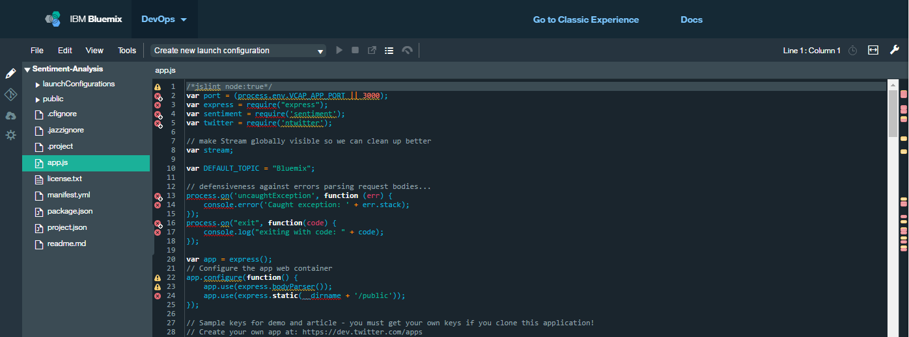

---

copyright:
  years: 2015, 2016

---

{:new_window: target="_blank"}
{:shortdesc: .shortdesc}
{:screen:.screen}
{:codeblock:.codeblock}
{:pre: .pre}

# 使用 Eclipse Orion {{site.data.keyword.webide}} 编辑代码
{: #web_ide}

上次更新时间：2016 年 7 月 22 日
{: .last-updated}

Eclipse Orion {{site.data.keyword.webide}} 是一种基于浏览器的开发环境，在此环境中可以针对 Web 进行开发。您可以使用 JavaScript、HTML 和 CSS 并借助内容辅助、代码补全和错误检查功能来进行开发。{{site.data.keyword.webide}} 几乎可以使用任何语言，并[针对大多数文件类型](https://hub.jazz.net/docs/overview/#dev_support){: new_window}提供语法突出显示。源代码控制通过 Git 或 Jazz SCM 内建，您可以本地部署代码来对应用程序进行测试和调试。
{:shortdesc}

首先，{{site.data.keyword.webide}} 由 Web 提供支持。您无需安装、维护或扩展。只要有因特网连接的地方，都可以进行开发。

## 设置编辑器
{: #editorsetup}

{{site.data.keyword.webide}} 可定制，这样您就能根据自己的开发需求来选择颜色方案、技术工具和设置。要查看和修改设置，请单击左侧菜单中的**设置**图标 。

<!-- LH: I don't think we need to include the following table, so I'm commenting it out. When you're viewing the settings in the Web IDE, this information should be obvious -->

<!--| Categories | Description  |
|---|---|
| Cloud Foundry  | Define a Cloud Foundry API and Manage URL  |
| CSS Validation | Define the severities for CSS linting rules that you use to check your code  |
| Editor Settings  | Configure editor-specific settings for key bindings, editor behavior, layout, and more  |
| Editor Styles  | Configure color schemes for the languages that you use, or import a theme from another editors  |
| Git  | Configure general settings for Git  |
| Globalization | Define globalization settings for your code |
| JavaScript Validation  | Define the severities for the JavaScript linting rules that you use to check your code  |
| Plug-ins  | Install, disable, or remove plug-ins from the editor  | -->

如果在编辑期间常常需要更改某些设置，那么可以通过编辑器右上角的**本地编辑器设置**图标  来快速访问这些设置。


缺省情况下，会始终显示编辑器样式和字体大小的设置。要在菜单中包含其他编辑器设置，请执行以下步骤：

1. 单击**本地编辑器设置**图标 。

2. 单击**编辑器设置**。

3. 要在**本地编辑器设置**菜单中包含或排除设置，请单击该设置旁边的圆圈。


## 编辑代码
{: #editcode}

{{site.data.keyword.webide}} 具有两个主要部分。第一个部分是左侧的文件导航器，以树结构显示项目文件。通过文件导航器，可以创建、重命名、删除和管理文件和文件夹。

**提示**：要将文件上传到文件导航器，请将文件从计算机拖至文件导航器。

第二个部分是右侧的编辑器窗格。编辑器提供了多种编码功能，包括内容辅助和语法验证。



### 处理多个文件
1. 要同时处理两个文件，请单击编辑器顶部的**更改拆分编辑器方式**图标 。
2. 在打开的菜单中，选择视图。

 选择视图后，如果文件已经在编辑器中打开，那么该文件会同时显示在这两个编辑器视图中。

 要打开或更改显示在其中一个编辑器视图中的文件，请执行以下操作：
 1. 将光标移至要更改的编辑器视图。
 2. 在文件导航器中，单击文件。

### 键盘快捷键
{{site.data.keyword.webide}} 中的大部分命令只能通过键盘快捷键来访问。

要查看编辑器中的键盘快捷键列表，请按 Alt+Shift+?。如果使用的是 Mac OS，请按 Ctrl+Shift+?。

## 管理源代码
{: #sourcecontrol}

{{site.data.keyword.webide}} 集成有源代码管理工具。要使用 Git 存储库，请单击 **Git 存储库**图标 。有关更多信息，请参阅 [Source control with Git](https://hub.jazz.net/docs/git/){: new_window}。


## 从工作空间部署应用程序
{: #deploy}

1. 要部署应用程序，请从运行栏中选择或[创建](https://hub.jazz.net/tutorials/livesync/#launch_configuration){: new_window}启动配置。
1. 单击“部署”图标。使用工作空间的当前内容以及在启动配置中定义的环境来部署应用程序的实例。 
2. 部署应用程序后，可以使用运行栏来停止、重新启动或调试应用程序、查看日志等。


<!-- LH: I'm commenting out the following list because I think this information is obvious from the UI. I also updated the preceding sentence to mention a few things that you can do from the run bar.

 * Stop the app: 
 * Open the deployed app: 
 * View the logs of the deployed app: 
 * Open the app's Dashboard: 
 * If you are developing a Node.js app, enable Live Edit mode: 
 * With Live Edit mode enabled, restart the app quickly, without redeployment: 
 * With Live Edit mode enabled, access the debugger:  -->

 ## 在 {{site.data.keyword.webide}} 外部进行编辑
{: #editlocal}

要使用非 {{site.data.keyword.webide}} 编辑器，请设置 {{site.data.keyword.Bluemix_live}}，以便可以直接在任何工具中处理项目文件。{{site.data.keyword.Bluemix_live_notm}} 是一种命令行应用程序，用于将本地文件系统中的更改与 {{site.data.keyword.jazzhub}} 中的云工作空间进行同步。 

### 开始之前 

[下载并安装 {{site.data.keyword.Bluemix_live_notm}} 命令行界面](http://livesyncdownload.ng.bluemix.net){: new_window}。

### 将本地环境与 {{site.data.keyword.Bluemix_notm}} 进行同步
{: #edit_local_download}

1. 打开命令行窗口。
2. 登录到 {{site.data.keyword.Bluemix_notm}}：

	```
	bl login
	```
	{: pre}

3. 系统提示时，输入 IBM 标识和密码。
4. 查看 {{site.data.keyword.Bluemix_notm}} 项目的列表： 

	```
	bl projects
	```
	{: pre}

4. 将本地环境与 {{site.data.keyword.Bluemix_notm}} 上的项目同步。

	```
	bl sync projectName
	```
	{: pre}

其中，`projectName` 是 {{site.data.keyword.Bluemix_notm}} 应用程序的名称。

完成编辑后，输入 `q` 以结束同步。

### 启用“桌面同步”功能以在本地编辑代码

“桌面同步”功能类似于命令行的“实时编辑”方式。您需要“桌面同步”功能以在命令行上进行调试。
1. 在其他命令行窗口中，启用“桌面同步”功能：

	```
	cd localDirectory
	bl start
	```
	{: codeblock}

2. 使用在 {{site.data.keyword.webide}} 中创建的启动配置。选择启动配置后，会在本地环境中启用“桌面同步”功能。在刚才打开的命令行窗口中，可以查看应用程序的 URL、调试 URL、管理 URL 以及查看 {{site.data.keyword.Bluemix_live_notm}} 状态。

3. 刷新浏览器，并验证是否可以查看保存到本地工作空间中静态文件的更改。 

### 禁用“桌面同步”功能

1. 在第二个命令行窗口中，输入 `bl stop`。
2. 在第一个命令行窗口中，输入 `q`。
