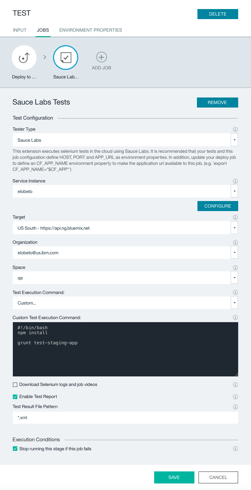

---

copyright:
  years: 2016

---

{:new_window: target="_blank"}
{:shortdesc: .shortdesc}
{:screen:.screen}
{:codeblock:.codeblock}

# 配置工具整合
{: #integrations}

*前次更新：2016 年 6 月 17 日*
{: .last-updated}

您可以在建立工具鏈時配置可支援開發、部署及操作作業的工具整合，也可以新增及配置用來自訂現有工具鏈的工具整合。  
{:shortdesc}

**重要事項**：這是實驗性功能。工具鏈可能不穩定，與舊版本不相容的部分也可能會變更。建議不要將它們用於正式作業環境。若要使用工具鏈，您必須進行一次性的[存取要求](https://new-console.ng.bluemix.net/devops?cm_mmc=IBMBluemixGarageMethod-_-MethodSite-_-10-19-15::12-31-18-_-toolchains-welcome-page){: new_window}。工具鏈只適用於美國南部地區。

**提示**：如果您要開始使用原始碼進行開發，請務必先配置 GitHub 和 GitHub Issues 工具整合，再配置 {{site.data.keyword.deliverypipeline}}。

## 配置 Delivery Pipeline
{: #deliverypipeline}

{{site.data.keyword.deliverypipeline}} 會透過數個系列的階段來自動化專案的持續部署，而這些階段會擷取輸入及執行工作（例如建置、測試及部署）。 

配置 {{site.data.keyword.deliverypipeline}} 來自動化您應用程式的持續建置、測試及部署： 

1. 如果您要在建立工具鏈時配置此工具整合，請按一下「可配置的整合」區段中的 **Delivery Pipeline**。根據您使用的範本，可能會有不同的欄位。請檢閱預設欄位值，並在必要時變更那些設定。
1. 如果您有工具鏈，並且要在其中新增此工具整合，請在 DevOps 儀表板的**工具鏈**標籤上按一下工具鏈，以開啟它的「工具整合」頁面。或者，在應用程式之「概觀」頁面的「持續交付」磚上，按一下**檢視工具鏈**。然後，按一下**工具整合**。 
1. 按一下新增按鈕 (+)。
1. 在「工具整合」區段中，按一下 **Delivery Pipeline**。
1. 指定新管線的名稱。
1. 如果您計劃使用管線來部署使用者介面，請選取**可檢視的應用程式**勾選框。管線所建立的所有應用程式都會顯示在工具鏈之「工具整合」頁面的**檢視應用程式**清單中。
1. 按一下**建立整合**，以將 {{site.data.keyword.deliverypipeline}} 新增至您的工具鏈。
1. 按一下 {{site.data.keyword.deliverypipeline}} 的磚來檢視管線，並對其進行配置。若要瞭解如何配置管線的基本觀念，請參閱[建置及部署管線](../services/DeliveryPipeline/build_deploy.html){: new_window}。

  **提示**：如果您要在將變更推送至 GitHub 儲存庫時觸發管線，必須先配置工具鏈的 GitHub，再定義管線的階段。管線階段需要 GitHub 儲存庫的 Git URL。每一個管線階段都只能參照與您工具鏈相關聯的其中一個 GitHub 儲存庫。如需配置 GitHub 的指示，請參閱 [GitHub 和 GitHub Issues](#github) 一節。
  
1. 選用項目：如果您想要 Sauce Labs 對您的應用程式執行測試，請配置 {{site.data.keyword.deliverypipeline}} 來新增 Sauce Labs 測試工作。如需配置測試工作的指示，請參閱[在管線中配置 Sauce Labs 測試工作](#config_saucelabs)一節。

### 在管線中配置 Sauce Labs 測試工作
{: #config_saucelabs}

您需要工作中管線有建置並部署應用程式的階段，而且必須為工具鏈配置 Sauce Labs，再於管線中配置 Sauce Labs 測試工作。如需配置 Sauce Labs 的指示，請參閱 [Sauce Labs](#saucelabs) 一節。

配置 {{site.data.keyword.deliverypipeline}} 來新增 Sauce Labs 測試工作：

1. 如果您沒有可部署您應用程式之測試版本的階段，請建立一個。
1. 在此階段中，於部署工作之後新增測試工作。將這些工作放在相同的階段中，它們即可存取一組相同的環境內容。
   

1. 配置階段： 

  a. 在**環境內容**標籤上，建立三個內容：CF_APP_NAME、SAUCE_USERNAME 及 SAUCE_ACCESS_KEY。
  
  b. 輸入 Sauce Labs 使用者名稱和存取金鑰。這麼做可以提出那些值，以將它們用於測試中。
  
1. 配置部署工作。在**部署 Script** 欄位中，包括下列指令：export CF_APP_NAME="$CF_APP"。該指令會將應用程式名稱匯出為環境內容。
1. 配置測試工作。下列影像中的值是範例。**服務實例**、**目標**、**組織**及**空間**欄位會移入您目前使用的 Sauce Labs 使用者名稱、地區、組織及空間。


  a. 針對測試器類型，選取 **Sauce Labs**。
  
  b. 針對服務實例，選取您為工具鏈配置 Sauce Labs 時所使用的 Sauce Labs 使用者名稱。 
  
   **提示**：若要查看您為工具鏈配置 Sauce Labs 時所使用的使用者名稱和存取金鑰，請按一下**配置**。 
  
  c. 在**測試執行指令**欄位中，輸入可安裝測試所需相依關係的指令，然後執行測試。例如，針對假設的 Node.js 應用程式，您可以輸入：
     ```
     npm install
     node_modules/grunt-cli/bin/grunt test:sauce:parallel
     ```
  
    d. 如果您要在測試工作日誌中查看測試報告，請選取**啟用測試報告**勾選框，然後將「測試結果檔案型樣」設為 `test/*.xml`。
  
1. 按一下**儲存**。現在，只要執行管線，就會執行 Sauce Labs 測試。

若要進一步瞭解，請參閱 [Delivery Pipeline](https://www.ibm.com/devops/method/content/deliver/tool_build_and_deploy/){: new_window}。

## 新增部署風險分析
{: #dra}

{{site.data.keyword.DRA_full}} 會收集並分析單元測試、功能測試及程式碼涵蓋面工具的結果，來判定您的程式碼是否符合部署程序中所指定閘道的預先定義準則。如果程式碼不符合或超出準則，則會停止部署，以防止釋出風險。您可以使用「部署風險分析」作為持續交付環境的安全網，或作為實作並改善品質標準的方法。 

 **提示**：這是預先配置的工具整合。它不需要任何配置參數，而且您無法重新配置它。
 
新增「部署風險分析」來維護和改善您的程式碼在 Bluemix 中的品質，方法是在發行部署之前監視部署來識別風險：

1. 如果您有工具鏈，並且要在其中新增此工具整合，請在 DevOps 儀表板的**工具鏈**標籤上按一下工具鏈，以開啟它的「工具整合」頁面。或者，在應用程式之「概觀」頁面的「持續交付」磚上，按一下**檢視工具鏈**。然後，按一下**工具整合**。 
1. 按一下新增按鈕 (+)。
1. 在「工具整合」區段中，按一下**部署風險分析**。 
1. 按一下**建立整合**。
1. 按一下「部署風險分析」的磚，然後完成入門步驟：建立準則，並將準則連接至管線，然後執行管線。如需相關資訊，請參閱[部署風險分析](https://www.ibm.com/devops/method/content/deliver/tool_deployment_risk_analytics/){: new_window}。

## 新增 Eclipse Orion {{site.data.keyword.webide}}
{: #webide}

Eclipse Orion {{site.data.keyword.webide}} 是一個整合的 Web 型環境，您可以在其中建立、編輯、執行、除錯以及完成來源控制作業。您可以平順地從編輯移至執行，再移至提交，然後移至部署。 

 **提示**：這是預先配置的工具整合。它不需要任何配置參數，而且您無法重新配置它。
 
新增 Eclipse Orion {{site.data.keyword.webide}} 工具整合來完成來源控制作業：

1. 如果您有工具鏈，並且要在其中新增此工具整合，請在 DevOps 儀表板的**工具鏈**標籤上按一下工具鏈，以開啟它的「工具整合」頁面。或者，在應用程式之「概觀」頁面的「持續交付」磚上，按一下**檢視工具鏈**。然後，按一下**工具整合**。 
1. 按一下新增按鈕 (+)。
1. 在「工具整合」區段中，按一下 **Eclipse Orion Web IDE**。 
1. 按一下**建立整合**。
1. 按一下新 Eclipse Orion Web IDE 的磚。您的工作區會預先移入您的 GitHub 儲存庫。會強調顯示與現行工具鏈相關聯的儲存庫。

若要進一步瞭解，請參閱 [Web IDE](https://www.ibm.com/devops/method/content/code/tool_web_ide/){: new_window}。


## 配置 GitHub 和 GitHub Issues
{: #github}

GitHub 是 Git 儲存庫的 Web 型管理服務。您可以同時具有儲存庫的本端和遠端副本，方便進行分工合作。 

GitHub Issues 是一個追蹤工具，可將您的工作和方案都保留在一個位置。它會與您的開發儲存庫整合，以聚焦在重要作業。

配置 GitHub 和 GitHub Issues，以在雲端上管理您的原始碼：

1. 如果您要在建立工具鏈時配置此工具整合，請遵循下列步驟：

 a. 在「可配置的整合」區段中，按一下 **GitHub**。如果您未授權 {{site.data.keyword.Bluemix}} 存取 GitHub，請按一下**授權**來移至 GitHub 網站。如果您沒有作用中的 GitHub 階段作業，則系統會提示您登入。按一下**授權應用程式**，以容許 {{site.data.keyword.Bluemix}} 存取 GitHub 帳戶。如果您有作用中的 GitHub 階段作業，但最近未輸入過密碼，則系統可能會提示您輸入 GitHub 密碼進行確認。
 
 b. 檢閱 GitHub 儲存庫的預設目標儲存庫位置。那些儲存庫是從範例儲存庫中複製而來。必要的話，請變更目標儲存庫的名稱。
 
   
1. 如果您有工具鏈，並且要在其中新增此工具整合，請在 DevOps 儀表板的**工具鏈**標籤上按一下工具鏈，以開啟它的「工具整合」頁面。或者，在應用程式之「概觀」頁面的「持續交付」磚上，按一下**檢視工具鏈**。然後，按一下**工具整合**。 
1. 按一下新增按鈕 (+)。
1. 在「工具整合」區段中，按一下 **GitHub**。
1. 如果您有 GitHub 儲存庫並且想要使用它，請鍵入 URL。針對儲存庫類型，請按一下**鏈結**。
1. 如果您要使用新的 GitHub 儲存庫，請鍵入 GitHub 儲存庫的名稱，並鍵入您所複製或分出之儲存庫的 URL，然後選取儲存庫類型： 

 a. 若要建立空的儲存庫，請選取**新建**。 
 
 b. 若要建立 GitHub 儲存庫的副本，請選取**複製**。
 
 c. 若要分出 GitHub 儲存庫，以透過取回要求來提出變更，請選取**分出**。
 
1. 如果您要使用 GitHub Issues 進行問題追蹤，請選取**啟用 GitHub Issues** 勾選框。
1. 按一下**建立整合**。
1. 按一下您要使用之 GitHub 儲存庫的磚來移至 github.com，然後檢視儲存庫的內容。
 
  **提示**：您可以使用 Eclipse Orion Web IDE 中的整合原始碼管理工具來編輯 GitHub 儲存庫，以及從工作區中部署應用程式。

1. 如果您已啟用 GitHub Issues，請按一下 GitHub Issues 的磚來移至 GitHub Issues。

若要進一步瞭解，請參閱 [GitHub](https://www.ibm.com/devops/method/content/code/tool_github/){: new_window} 和 [GitHub Issues](https://www.ibm.com/devops/method/content/think/tool_github_issues/){: new_window}。    

##使用專用 {{site.data.keyword.ghe_short}}
{: #ghe}

{{site.data.keyword.ghe_long}} 是 {{site.data.keyword.ghe_short}} 的 IBM 雲端代管和完整受管理版本，適用於「專用 Bluemix」環境。GitHub 提供開發人員所喜歡的社交程式碼編寫經驗。[{{site.data.keyword.Bluemix_notm}} 專用](../dedicated/index.html#dedicated){: new_window}提供整合至您網路之實際隔離硬體上的雲端運算環境。

「專用 {{site.data.keyword.ghe_short}}」僅供「{{site.data.keyword.Bluemix_notm}} 專用」客戶使用。

### 設定帳戶 

{{site.data.keyword.ghe_short}} 包括使用「{{site.data.keyword.Bluemix_notm}} 專用」的單一登入。若要登入 {{site.data.keyword.ghe_short}}，請將 URL 從地區管理者或歡迎使用電子郵件貼入瀏覽器。您的 URL 將遵循下列型樣：`github.your-company-dedicated-name.bluemix.net`。請使用「{{site.data.keyword.Bluemix_notm}} 專用」使用者 ID 和密碼進行登入，即會自動建立 {{site.data.keyword.ghe_short}} 帳戶。

**附註：**如果訊息指出您的使用者 ID 不存在，請要求您的地區管理者將您的使用者 ID 新增至「{{site.data.keyword.Bluemix_notm}} 專用」使用者登錄。如果您是地區管理者，請參閱[管理 {{site.data.keyword.Bluemix_notm}} 專用使用者和許可權](https://new-console.stage1.ng.bluemix.net/docs/admin/index.html#oc_useradmin){: new_window}。

在大部分情況下，除非您的電子郵件簡稱包括 GitHub 不支援的字元（例如句點），否則 GitHub 使用者名稱就是您的簡稱。如果您的簡稱包括 GitHub 不支援的字元，則會將字元取代為橫線。     

### 將電子郵件位址新增至帳戶

您必須將電子郵件位址新增至 {{site.data.keyword.ghe_short}} 帳戶設定，才能接收通知。新增電子郵件位址之後，即可利用 {{site.data.keyword.ghe_short}} 的社交程式碼編寫特性。    
 
若要將電子郵件位址新增至「專用 {{site.data.keyword.ghe_short}}」帳戶，請完成下列步驟：    
1. 在任何 GitHub 頁面的右上角，按一下您的設定檔圖示，然後按一下**設定**。    
2. 在資訊看板上，按一下**電子郵件**。    
3. 新增您的電子郵件位址，然後按一下**新增**。     

{: #ghe_auth}
### 建立個人存取記號或 SSH 金鑰來進行鑑別

若要從本端 Git 儲存庫中執行遠端 Git 作業（如 `clone` 或 `push`），您必須使用個人存取記號或 SSH 金鑰向 {{site.data.keyword.ghe_short}} 進行鑑別。只有使用存取記號才支援透過 HTTPS 的鑑別；您無法使用使用者 ID 和密碼，從本端儲存庫中進行複製或推送。API 要求也需要個人存取記號。

**附註：**若要使用個人存取記號或 SSH 金鑰來進行鑑別，您必須在本端設定 Git。如需指示，請參關[設定 Git](https://help.github.com/enterprise/2.6/user/articles/set-up-git/){: new_window}。    

若要建立個人存取記號，請完成下列步驟：    
   1. 在任何 GitHub 頁面的右上角，按一下您的設定檔圖示，然後按一下**設定**。    
   2. 在資訊看板上，按一下**個人存取記號**。   
   3. 按一下**產生新記號**。
   4. 新增記號說明，然後按一下**產生記號**。
   5. 將此記號複製至安全位置或密碼管理應用程式。
     **附註：**基於安全理由，離開此頁面之後，即無法再看到該記號。    

使用個人存取記號而非密碼，來進行透過 HTTPS 的指令行存取。 


若要建立 SSH 金鑰，請完成下列步驟：
   1. 開啟 Git Bash (Windows) 或新的「終端機」視窗（Linux 和 Mac）。    
   2. 貼上下列文字，並替換您已新增至 {{site.data.keyword.ghe_short}} 帳戶的電子郵件位址：
   
     ```
     ssh-keygen -t rsa -b 4096 -C "your_email@example.com"
     # 使用提供的電子郵件作為標籤來建立新的 SSH 金鑰
     Generating public/private rsa key pair.
     ```

   3. 系統提示您指定用來儲存金鑰的檔案時，請按 Enter 鍵來接受預設位置。
   4. 在提示中，鍵入安全的通行詞組。如需相關資訊，請參閱[使用 SSH 金鑰通行詞組](https://help.github.com/enterprise/2.6/user/articles/working-with-ssh-key-passphrases/){: new_window}。   

將 SSH 金鑰新增至 ssh-agent：    
   1. 確定已啟用 ssh-agent。使用 Git Bash，輸入此指令來啟用 ssh-agent：
      ```
      # 在背景中啟動 ssh-agent
      $ eval "$(ssh-agent -s)"
      Agent pid 59566
      ```    
  
   2. 輸入下列指令，以將 SSH 金鑰新增至 ssh-agent：
      ```
      $ ssh-add ~/.ssh/id_rsa
      ```    
   3. 將 SSH 金鑰新增至 GitHub 帳戶。如需相關資訊，請參閱[將新的 SSH 金鑰新增至 GitHub 帳戶](https://help.github.com/enterprise/2.6/user/articles/adding-a-new-ssh-key-to-your-github-account/){: new_window}。    
   

### 設定 GitHub 組織、團隊及儲存庫    

設定 GitHub 組織十分有用，因為您會建立處理類似專案或作業的特殊使用者群組。在組織內組織團隊的附加好處是可控制對儲存庫的存取。如需相關資訊，請參閱[組織和團隊](https://help.github.com/enterprise/2.6/admin/guides/user-management/organizations-and-teams/){: new_window}。

**附註：**GitHub 組織與 Bluemix 組織不同。

請完成下列作業，來設定您團隊的專案：

   1. [建立組織](https://help.github.com/enterprise/2.6/user/articles/creating-a-new-organization-account/){: new_window}。
   2. [建立組織的儲存庫](https://help.github.com/enterprise/2.6/user/articles/create-a-repo/){: new_window}。
   3. [邀請使用者加入您的組織](https://help.github.com/enterprise/2.6/user/articles/inviting-users-to-join-your-organization/){: new_window}。
   4. [小心地選取至少一個團隊成員，使其在組織中具有擁有者許可權](https://help.github.com/enterprise/2.6/user/articles/changing-a-person-s-role-to-owner/){: new_window}。    
   
  **附註：**邀請使用者加入您的組織之前，使用者必須先登入 {{site.data.keyword.ghe_short}} 至少一次，否則將無法邀請其 {{site.data.keyword.ghe_short}} 帳戶。
   
### 取得支援
若要立即獲得答案，請將問題提交至 [Stack Overflow](http://stackoverflow.com/questions/ask?tags=ibm-bluemix_github-enterprise){: new_window}。 

如需其他支援，請使用下列資源：    
   1. 完成 https://ibm.biz/bluemixsupport 上的表單。   
   2. 透過 Client Success Portal（網址為 https://support.ibmcloud.com/ics/support/mylogin.asp?login=bluemix）提交新的問題單。    


## 配置 PagerDuty
{: #pagerduty}

PagerDuty 會將多個監視系統中的資料整合至單一視圖。發生問題時，PagerDuty 可確保那時最能修正該問題的團隊成員收到通知。如果團隊成員未回應該問題，則可以配置呈報，將它遞送給次要工程師或作業管理員。

配置 PagerDuty 在管線階段失敗時傳送通知，讓您可以更快速地修正問題，並減少關閉時間：

1. 如果您要在建立工具鏈時配置此工具整合，請按一下「可配置的整合」區段中的 **PagerDuty**。
1. 如果您有工具鏈，並且要在其中新增此工具整合，請在 DevOps 儀表板的**工具鏈**標籤上按一下工具鏈，以開啟它的「工具整合」頁面。或者，在應用程式之「概觀」頁面的「持續交付」磚上，按一下**檢視工具鏈**。然後，按一下**工具整合**。 
1. 按一下新增按鈕 (+)。
1. 在「工具整合」區段中，按一下 **PagerDuty**。
1. 鍵入與 PagerDuty 帳戶相關聯的 PagerDuty 網站名稱。如果您沒有 PagerDuty 帳戶，請[註冊一個帳戶](https://signup.pagerduty.com/accounts/new){: new_window}。
1. 鍵入 PagerDuty 帳戶的 API 存取金鑰。如需尋找金鑰的指示，請參閱 [API 鑑別](https://signup.pagerduty.com/accounts/new){: new_window}。
1. 鍵入 PagerDuty 服務的名稱。
1. 鍵入主要 PagerDuty 聯絡人的電子郵件位址。
1. 鍵入主要 PagerDuty 聯絡人的電話號碼。
1. 按一下**建立整合**。
1. 按一下 PagerDuty 的磚以移至 pagerduty.com。您可以檢視與 PagerDuty 服務相關聯的事件，而 PagerDuty 服務是您在配置工具鏈的這個工具整合時所指定。 

若要進一步瞭解，請參閱 [PagerDuty](https://www.ibm.com/devops/method/content/manage/tool_pagerduty/){: new_window}。


## 配置 Sauce Labs
{: #saucelabs}

Sauce Labs 會執行功能單元測試。在 {{site.data.keyword.deliverypipeline}} 中將 Sauce Labs 測試套組配置為測試工作時，測試套組可以在持續交付處理程序期間對 Web 或行動應用程式執行測試。這些測試可以提供對專案的重要流程控制，作為防止部署不正確程式碼的閘道。

配置 Sauce Labs 對多個作業系統和瀏覽器執行自動化功能測試，讓您模擬使用者可能使用網站或應用程式的方式：

1. 如果您要在建立工具鏈時配置此工具整合，請按一下「可配置的整合」區段中的 **Sauce Labs**。
1. 如果您有工具鏈，並且要在其中新增此工具整合，請在 DevOps 儀表板的**工具鏈**標籤上按一下工具鏈，以開啟它的「工具整合」頁面。或者，在應用程式之「概觀」頁面的「持續交付」磚上，按一下**檢視工具鏈**。然後，按一下**工具整合**。 
1. 按一下新增按鈕 (+)。
1. 在「工具整合」區段中，按一下 **Sauce Labs**。
1. 鍵入與 Sauce Labs 帳戶相關聯的使用者名稱。您可以[在 Sauce Labs 帳戶頁面頂端的歡迎使用訊息中找到使用者名稱](https://saucelabs.com/account){: new_window}。
1. 鍵入 Sauce Labs 帳戶的存取金鑰。您可以[在 Sauce Labs 帳戶頁面的左下角找到金鑰](https://saucelabs.com/account){: new_window}。
1. 按一下**建立整合**。
1. 按一下 Sauce Labs 的磚以移至 saucelabs.com，然後檢視工具鏈的測試活動。

 **提示**：如果您已將 Sauce Labs 測試工作新增至 {{site.data.keyword.deliverypipeline}}，則可以選取服務實例。

若要進一步瞭解，請參閱 [Sauce Labs](https://www.ibm.com/devops/method/content/code/tool_sauce_labs/){: new_window}。


## 配置 Slack
{: #slack}

**重要事項**：團隊的所有人都可以看到張貼到公用 Slack 通道的通知。請記住，您需要自行負責所張貼的內容。

Slack 是一種雲端型、即時傳訊和通知系統。Slack 會提供持續性會談，這在進行團隊協同作業時比電子郵件更具互動性。您可以透過專用通道或與工作直接相關的一組通道來與團隊進行通訊。您也可以透過通道或兩位以上人員之間的直接訊息來共用檔案和影像。會保留透過直接訊息和通道的通訊，讓您可以搜尋它們。 

配置 Slack 接收來自工具整合有關工具鏈的通知（例如測試和部署活動）：

1. 如果您要在建立工具鏈時配置此工具整合，請按一下「可配置的整合」區段中的 **Slack**。
1. 如果您有工具鏈，並且要在其中新增此工具整合，請在 DevOps 儀表板的**工具鏈**標籤上按一下工具鏈，以開啟它的「工具整合」頁面。或者，在應用程式之「概觀」頁面的「持續交付」磚上，按一下**檢視工具鏈**。然後，按一下**工具整合**。
1. 按一下新增按鈕 (+)。
1. 在「工具整合」區段中，按一下 **Slack**。
1. 鍵入 Slack 帳戶的 API 鑑別記號。您必須使用產生的完整存取記號向 Slack 進行鑑別。如需尋找記號的指示，請參閱 [Slack 鑑別](https://api.slack.com/web#authentication){: new_window}。
1. 鍵入您要接收通知的 Slack 通道名稱。如果您指定的通道不存在，則會建立它。如果已保存通道，則會重新啟動它。
1. 按一下**建立整合**。
1. 按一下 Slack 的磚。您可以在已配置的 Slack 通道中檢視工具鏈的所有活動。

若要進一步瞭解，請參閱 [Slack](https://www.ibm.com/devops/method/content/culture/tool_slack/){: new_window}。
